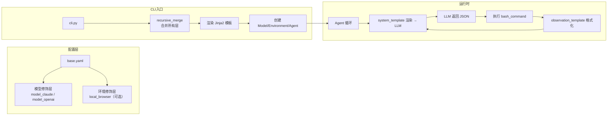

# Webwright 配置文件系统分析

> 以 `base.yaml` 为核心，分析各配置项的作用和整体架构。

---

## 一、配置系统架构

### 1.1 分层叠加机制

Webwright 的配置采用**分层叠加**（layer stacking）模式，通过 `-c` 参数多次叠加：

```bash
python -m webwright.run.cli \
  -c base.yaml \              # 基础配置（模型无关）
  -c model_claude.yaml \      # 模型修饰层
  -t "任务描述" \
  --start-url https://...
```

叠加顺序：**后面的层覆盖前面的层**，通过 `recursive_merge()` 实现深层合并。

### 1.2 配置文件清单

| 文件 | 用途 | 是否可单独运行 |
|---|---|---|
| `base.yaml` | **核心基础配置**，含所有模型无关的设置 | 是（搭配模型配置） |
| `model_claude.yaml` | Claude (Anthropic) 模型修饰层 | ❌ 须叠加 |
| `model_openai.yaml` | OpenAI GPT 模型修饰层 | ❌ 须叠加 |
| `model_openrouter.yaml` | 通用 OpenRouter 修饰层（指向 OpenAI 模型） | ❌ 须叠加 |
| `custom_openrouter.yaml` | 自定义 OpenRouter 修饰层（指向 Qwen 等第三方模型） | ❌ 须叠加 |
| `local_browser.yaml` | **实时浏览器模式**修饰层，Agent 直接驱动 `page` 对象 | ❌ 须叠加 |
| `persistent_browser.yaml` | **持久化浏览器模式**，基于 CDP 连接持久的 Chromium 进程 | ✅ 是（替代 `base.yaml`） |
| `crafted_cli.yaml` | **剧本模式**（crafted CLI），Agent 按剧本执行脚本 | ✅ 是（替代 `base.yaml`） |
| `task_showcase.yaml` | 任务展示配置（类似 `base.yaml` 但针对展示场景） | ✅ 是（替代 `base.yaml`） |

---

## 二、配置顶层键说明

每一个 yaml 文件在顶层有四个主要区块：

```
model:          # 模型配置
environment:    # 运行环境配置
run:            # 运行参数（默认值）
agent:          # Agent 行为配置
```

---

## 三、`model:` — 模型配置

### 3.1 配置项

```yaml
model:
  model_class: anthropic          # 模型客户端类型
  model_name: claude-opus-4-7     # 具体的模型名称
  anthropic_endpoint: ...         # Anthropic API 端点
  anthropic_version: "2023-06-01" # API 版本
  request_timeout_seconds: 120    # HTTP 请求超时
  max_output_tokens: 4000         # 每步最大输出 token 数
  attach_observation_screenshot: false  # 是否自动附加截图到提示词
  observation_template: |          # 观察结果格式化模板（Jinja2）
  format_error_template: |         # 格式错误时给 Agent 的提示
```

### 3.2 各配置项作用

| 配置项 | 默认值 | 作用 |
|---|---|---|
| `model_class` | 无（由修饰层决定） | 指定模型客户端实现：`anthropic`、`openai`、`openrouter` |
| `model_name` | 无（由修饰层决定） | 传递给 API 的模型标识符 |
| `*_endpoint` | 无（由修饰层决定） | 不同模型类的 API 端点 URL |
| `anthropic_version` | `2023-06-01` | Anthropic API 版本号 |
| `request_timeout_seconds` | 120 | 每次 LLM API 调用的超时时间 |
| `max_output_tokens` | 4000 | LLM 每步最大输出 token 数 |
| `attach_observation_screenshot` | `false` | **关键配置**——是否自动将当前页面的截图作为图片输入附加到每一轮的提示词中。设为 `true` 会消耗大量图片 token，但让 LLM 能直接看到页面 |
| `observation_template` | — | Jinja2 模板，格式化 bash 命令的执行结果（stdout、返回码等），作为 LLM 的观察输入 |
| `format_error_template` | — | 当 Agent 返回的 JSON 格式错误时的提示信息 |

### 3.3 模型修饰层对比

| 文件 | `model_class` | `model_name` | 端点 |
|---|---|---|---|
| `model_claude.yaml` | `anthropic` | `claude-opus-4-7` | `https://api.anthropic.com/v1/messages` |
| `model_openai.yaml` | `openai` | `gpt-5.4` | `https://api.openai.com/v1/responses` |
| `model_openrouter.yaml` | `openrouter` | `openai/gpt-5.4` | `https://openrouter.ai/api/v1/chat/completions` |
| `custom_openrouter.yaml` | `openrouter` | `qwen3.7-plus` | `https://dashscope.aliyuncs.com/compatible-mode/v1/chat/completions` |

---

## 四、`environment:` — 环境配置

### 4.1 配置项

```yaml
environment:
  environment_class: local_workspace    # 环境实现类
  start_url:                            # 起始 URL
  output_dir: outputs/default           # 输出目录
  command_timeout_seconds: 240          # bash 命令超时
  shell: /bin/bash                      # Shell 路径
  credentials_file:                     # 凭证文件路径
  browser_mode: local                   # 浏览器模式
  task_metadata_filename: task.json     # 任务元数据文件名
  final_script_name: final_script.py    # 最终脚本文件名
  output_truncation_chars: 24000        # 命令输出截断字符数
  final_script_preview_chars: 4000      # 脚本预览截断字符数
  recent_files_limit: 40                # 最近文件列表数量限制
  env:                                  # 传递给子进程的环境变量
    PAGER: cat
    MANPAGER: cat
    LESS: -R
    PIP_PROGRESS_BAR: 'off'
    TQDM_DISABLE: '1'
```

### 4.2 各配置项作用

| 配置项 | 默认值 | 作用 |
|---|---|---|
| `environment_class` | `local_workspace` | 环境实现类。可选值：`local_workspace`（标准模式）、`local_browser`（实时浏览器模式） |
| `start_url` | 无 | Agent 任务的起始 URL |
| `output_dir` | `outputs/default` | 所有运行产物的根输出目录 |
| `command_timeout_seconds` | 240 | 每次 bash 命令的最大执行时间（超时会被 kill） |
| `shell` | `/bin/bash` | 执行命令用的 Shell 路径 |
| `credentials_file` | 空串 | 包含 API 密钥的 Shell 文件路径。留空则从父进程环境变量读取 |
| `browser_mode` | `local` | Agent 生成脚本时使用的浏览器模式：`local`（本地 Playwright）、`browserbase`（Browserbase 云会话） |
| `task_metadata_filename` | `task.json` | 任务元数据 JSON 文件名 |
| `final_script_name` | `final_script.py` | Agent 最终生成的脚本文件名 |
| `output_truncation_chars` | 24000 | bash 命令的输出超长时截断的字符数，防止提示词过大 |
| `final_script_preview_chars` | 4000 | 预览 `final_script.py` 时截断的字符数 |
| `recent_files_limit` | 40 | Agent 看到的工作空间最近文件列表数量 |
| `env` | — | 传递给每个 bash 子进程的额外环境变量（禁用交互式 pager、进度条等） |

### 4.3 `local_browser.yaml` 的覆盖

在实时浏览器模式下，`environment` 被替换为：

```yaml
environment:
  environment_class: local_browser
  browser_mode: local_cdp         # 默认使用 CDP 连接真实浏览器
  local_cdp_new_page: true        # 每次运行创建新标签页
```

---

## 五、`run:` — 运行参数

```yaml
run:
  task:          # 任务描述（自然语言）
  task_id:       # 任务标识符（用于输出目录命名）
  start_url:     # 起始 URL
```

这三个都是 CLI 的默认值，可以在命令行通过 `-t`、`--task-id`、`--start-url` 覆盖。`task` 是必填项。

---

## 六、`agent:` — Agent 行为配置

### 6.1 配置项

```yaml
agent:
  agent_class: default                # Agent 实现类
  debug_log: true                     # 是否输出调试日志
  output_path: outputs/default/trajectory.json  # 轨迹文件输出路径
  step_limit: 100                     # 最大步数限制
  require_self_reflection_success: true   # 是否要求 self_reflection 通过
  summary_every_n_steps: 20          # 每隔多少步进行上下文压缩摘要
```

### 6.2 各配置项作用

| 配置项 | 默认值 | 作用 |
|---|---|---|
| `agent_class` | `default` | Agent 实现类。不同模式使用不同的 Agent |
| `debug_log` | `true` | 是否将交互轨迹写入输出文件 |
| `output_path` | — | 轨迹 JSON 文件的输出路径（含每步的 thought、command、observation） |
| `step_limit` | 100 | 最大迭代步数，超过后 Agent 被强制终止 |
| `require_self_reflection_success` | `true` | 是否要求 `self_reflection` 裁判结果为 PASS 才能算任务完成 |
| `summary_every_n_steps` | 20 | 每 N 步对历史上下文做一次**压缩摘要**，控制 token 消耗 |

### 6.3 `local_browser.yaml` 的覆盖

实时浏览器模式下覆盖了以下配置：

```yaml
agent:
  require_self_reflection_success: false    # 不需要自我反思裁判
  keep_last_n_observations: 1               # 只保留最近 1 步的 ARIA 快照
  summary_user_prompt: |                    # 自定义压缩摘要提示词
    ...（针对浏览器状态定制的摘要模板）
  system_template: |                        # 自定义系统提示词
    ...（使用 `python_code` 字段而非 `bash_command`）
  instance_template: |                      # 自定义实例化模板
    ...（简化版，无 workspace 相关指令）
```

关键差异：
- `require_self_reflection_success: false` — 实时浏览器模式没有最终脚本，不需要裁判
- `keep_last_n_observations: 1` — ARIA 快照非常大，只保留最近一个，节省 token
- `action_field: python_code` — 用 `python_code` 替代 `bash_command`，直接驱动浏览器
- `system_template` / `instance_template` 全部替换为针对实时浏览器优化的版本

---

## 七、`system_template` 与 `instance_template`

这两个是 **Jinja2 模板**，在运行时渲染后作为 LLM 的系统提示词和任务实例提示词。

### 7.1 `system_template` — 系统提示词模板

位于 `base.yaml` 第 92~314 行，包含：
- **JSON 响应格式**要求（`thought`、`bash_command`、`done`、`final_response`）
- **全局约束**（单命令、无持久浏览器、自动不附加截图等）
- **浏览器模式**说明（`BROWSER_MODE`）
- **Playwright 示例**代码
- **常用命令模板**（sed、ls、image_qa CLI）
- **规则**列表
- **Task Reflection 工具**说明（self_reflection 两阶段流程配置）
- **完成检查门**（`done: true` 的 5 个先决条件）

### 7.2 `instance_template` — 实例提示词模板

位于 `base.yaml` 第 316~411 行，包含：
- 任务信息（Task / Task ID / Start URL / Workspace）
- **任务说明**
- **工具集规则**（工作空间边界、产物存放规范）
- **Web 任务规则**
- **任务成功标准**（8 条）
- **Image QA 工具**使用说明
- **推荐工作流程**（6 步：规划 → 编写配置 → 探索 → 最终脚本 → self_reflection → 声明完成）
- **最终脚本仪器化**规范
- **完成检查门**（5 条件）

---

## 八、完整配置工作流



### 8.1 配置合并示例

**输入：**
```bash
python -m webwright.run.cli -c base.yaml -c model_claude.yaml -t "搜索X"
```

**合并后 `model` 块：**
```yaml
model:
  model_class: anthropic              # 来自 model_claude.yaml
  model_name: claude-opus-4-7         # 来自 model_claude.yaml
  anthropic_endpoint: https://api.anthropic.com/v1/messages   # 来自 model_claude.yaml
  anthropic_version: "2023-06-01"     # 来自 model_claude.yaml
  request_timeout_seconds: 120        # 来自 base.yaml（未被覆盖）
  max_output_tokens: 4000             # 来自 base.yaml（未被覆盖）
  attach_observation_screenshot: false # 来自 base.yaml
  observation_template: |              # 来自 base.yaml
  format_error_template: |             # 来自 base.yaml
```
