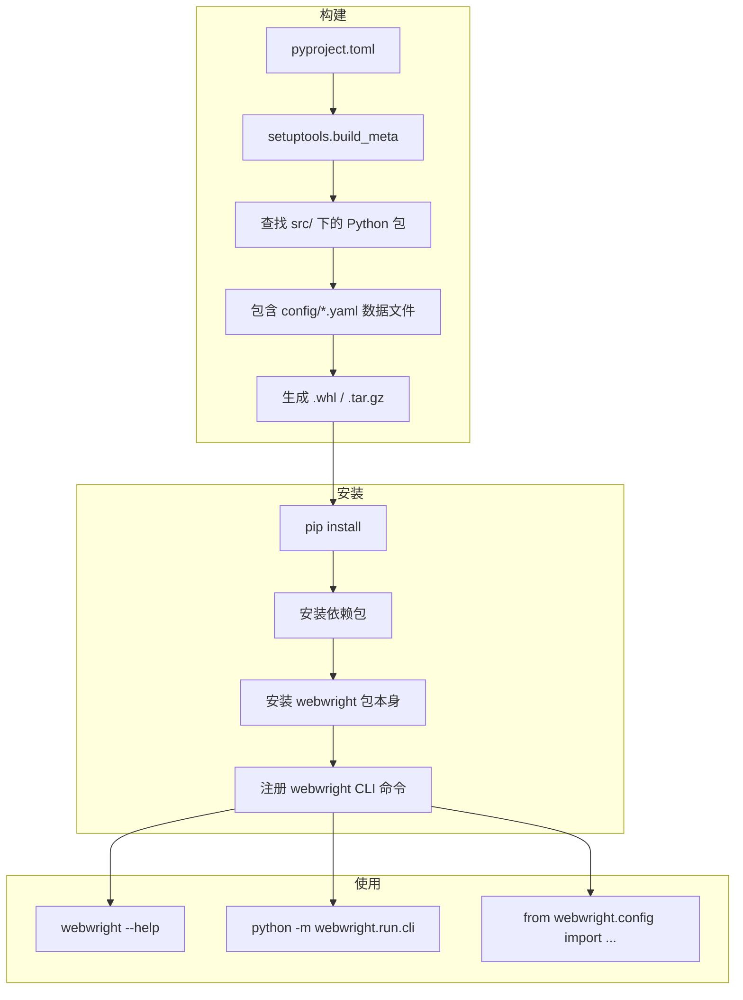

# `pyproject.toml` 配置分析

> 这是 Webwright 项目的 Python 包构建配置文件，遵循 PEP 621 规范。

---

## 一、文件概览

这是一个标准的 Python 项目 `pyproject.toml`，使用 `setuptools` 作为构建后端，定义了项目的元数据、依赖、入口脚本和包分发配置。

---

## 二、`[build-system]` — 构建系统

```toml
[build-system]
requires = ["setuptools>=61", "wheel"]
build-backend = "setuptools.build_meta"
```

| 配置项 | 值 | 说明 |
|---|---|---|
| `requires` | `setuptools>=61, wheel` | 构建项目所需的 Python 包。`setuptools>=61` 是为了支持 `pyproject.toml` 中的 `[project]` 表（PEP 621）。`wheel` 用于生成 `.whl` 分发包 |
| `build-backend` | `setuptools.build_meta` | 指定构建后端为 setuptools，执行 `pip install` 或 `python -m build` 时 setuptools 负责编译和打包 |

> 注意：`setuptools>=61` 是必需的，因为低于 61 的版本不支持从 `pyproject.toml` 读取 `[project]` 元数据，仍需依赖 `setup.py` 或 `setup.cfg`。

---

## 三、`[project]` — 项目元数据

```toml
[project]
name = "webwright"
version = "0.1.0"
description = "Webwright: tiny SWE-style web agent harness"
requires-python = ">=3.10"
dependencies = [
    "httpx>=0.27",
    "jinja2>=3.1",
    "pydantic>=2.5",
    "pyyaml>=6.0",
    "rich>=13.0",
    "typer>=0.12",
    "playwright>=1.45",
    "python-dotenv>=1.0",
    "platformdirs>=4.0",
]
```

### 3.1 基本信息

| 字段 | 值 | 说明 |
|---|---|---|
| `name` | `webwright` | 包名，用于 PyPI 发布和 `pip install webwright` |
| `version` | `0.1.0` | 版本号，遵循语义化版本（major.minor.patch），0.1.0 表示早期开发阶段 |
| `description` | `Webwright: tiny SWE-style web agent harness` | 简短描述，"tiny SWE-style web agent harness" 即"小型 SWE 风格 Web Agent 工具集" |
| `requires-python` | `>=3.10` | 最低 Python 版本要求。3.10 引入了 `match` 语句和更好的类型提示支持 |

### 3.2 生产依赖说明

| 包名 | 最低版本 | 作用 |
|---|---|---|
| `httpx` | 0.27 | **HTTP 客户端库**。用于调用 LLM API（Anthropic、OpenAI、OpenRouter 等），支持异步和同步请求 |
| `jinja2` | 3.1 | **模板引擎**。用于渲染系统提示词模板（`system_template`、`instance_template`、`observation_template` 等 Jinja2 模板） |
| `pydantic` | 2.5 | **数据验证库**。用于配置类的类型校验（`LocalWorkspaceEnvironmentConfig`、`LocalBrowserEnvironmentConfig` 等都继承自 `BaseModel`） |
| `pyyaml` | 6.0 | **YAML 解析库**。用于加载 `.yaml` 配置文件（`base.yaml`、`model_claude.yaml` 等） |
| `rich` | 13.0 | **终端美化**。用于 CLI 输出的彩色打印（`rich.console.Console`） |
| `typer` | 0.12 | **CLI 框架**。用于构建命令行接口（`cli.py` 中使用 `typer.Option` 定义参数） |
| `playwright` | 1.45 | **浏览器自动化**。用于网页交互操作（导航、截图、ARIA 快照等） |
| `python-dotenv` | 1.0 | **环境变量加载**。用于从 `.env` 文件加载 API 密钥等敏感信息 |
| `platformdirs` | 4.0 | **跨平台目录**。用于获取操作系统标准的配置/缓存/数据目录路径 |

---

## 四、`[project.scripts]` — 命令行入口

```toml
[project.scripts]
webwright = "webwright.run.cli:app"
```

这定义了一个**控制台脚本入口点**。安装包后，终端中可以直接运行：

```bash
webwright --help
```

等价于：

```bash
python -m webwright.run.cli --help
```

指向的是 `src/webwright/run/cli.py` 中定义的 `app` 对象（`typer.Typer()` 实例）。

---

## 五、`[tool.setuptools.packages.find]` — 包发现

```toml
[tool.setuptools.packages.find]
where = ["src"]
```

告诉 setuptools 在 `src/` 目录下递归查找 Python 包，而不是默认的项目根目录。这是**src 布局**（src layout）的标准写法：

```
webwright/
├── pyproject.toml
├── src/
│   └── webwright/
│       ├── __init__.py
│       ├── agents/
│       ├── config/
│       ├── environments/
│       ├── models/
│       ├── run/
│       ├── tools/
│       └── utils/
└── ...
```

使用 src 布局的好处：
- 防止在开发和测试时意外导入项目根目录中的代码而非已安装的包
- 打包配置与源代码分离

---

## 六、`[tool.setuptools.package-data]` — 包数据文件

```toml
[tool.setuptools.package-data]
webwright = ["config/*.yaml", "config/**/*.yaml"]
```

指定在安装包时，需要包含的非 Python 文件（data files）：

| Globs | 匹配的文件 |
|---|---|
| `config/*.yaml` | `src/webwright/config/base.yaml`、`model_claude.yaml` 等**顶层** yaml |
| `config/**/*.yaml` | `config/` 下**所有子目录**中的 yaml 文件（递归） |

没有这个配置，`pip install` 时只有 `.py` 文件会被安装，yaml 配置文件会丢失，运行时会报"找不到配置文件"的错误。

---

## 七、缺失的配置项分析

### 7.1 缺少 `[project.urls]`

没有定义项目 URL（如源代码仓库、文档、Bug 跟踪），影响不大但不符合最佳实践。

### 7.2 缺少 `[project.optional-dependencies]`

没有定义可选依赖组，例如：

```toml
[project.optional-dependencies]
dev = ["pytest>=7.0", "ruff>=0.3", "mypy>=1.0"]
test = ["pytest>=7.0"]
```

当前项目中没有专门的开发/测试依赖声明。

### 7.3 缺少 `readme` 和 `license`

没有指定 README 文件路径和许可证信息。理论上这些应该通过 `[project]` 表的 `readme` 和 `license` 字段补充。

---

## 八、完整配置流


