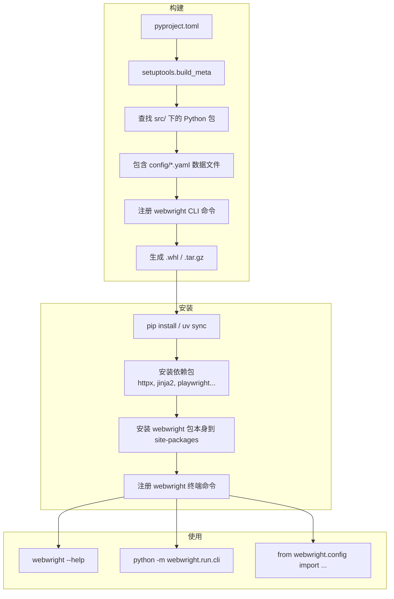

# Python 项目打包与 `pyproject.toml` 解析

> 从 Webwright 项目的 `pyproject.toml` 出发，解释 Python 打包的底层逻辑，并与前端构建工具（Vite）对比。

---

## 一、Python 打包 vs 前端打包

### 1.1 直观对比

| 步骤 | 前端（Vite） | Python（setuptools） |
|---|---|---|
| **输入** | 源码（.ts/.jsx/.vue） | 源码（.py） |
| **构建命令** | `vite build` | `python -m build` |
| **临时依赖** | devDependencies（vite, esbuild） | `build-system.requires`（setuptools, wheel） |
| **产物流** | `dist/` 目录 | `dist/` 目录 |

### 1.2 本质区别

**前端打包（Vite）— 代码转换**

```
src/main.tsx  ──→  [Vite 构建]  ──→  dist/assets/index.a1b2c3.js
                                       （压缩、转译、tree-shaking、
                                        代码拆分、hash 命名）
```

Vite 的构建做的是**代码本身的转变**：
- TypeScript → JavaScript（转译）
- JSX → createElement 调用
- 多个模块 → 合并成少量 chunk（打包）
- 去掉无用代码（tree-shaking）
- 压缩混淆（minify）
- 加 hash 用于缓存控制

**产出的是给浏览器运行的不同形态的代码。**

**Python 打包（setuptools）— 代码的整理+归档**

```
src/webwright/  ──→  [python -m build]  ──→  dist/webwright-0.1.0-py3-none-any.whl
（.py 源码本身）                            （.whl 是 zip 压缩包）
```

setuptools 的构建**几乎不改变代码本身**：
- 找到哪些 `.py` 文件属于这个包
- 把指定的数据文件（`.yaml`）包含进去
- 注册 CLI 入口点
- 把所有文件**打包成一个 zip**（.whl）或 tar.gz

**没有转译、没有压缩、没有 tree-shaking。.py 进去，.py 出来。**

### 1.3 一个形象的类比

```
前端：TypeScript 书稿 → 出版社翻译成英文、排版、印刷成书 → 你拿到书读
Python：手写笔记 → 直接装进档案袋 → 你打开档案袋还是同一份手写笔记
```

### 1.4 Python 打包的真正目的

| 目的 | 说明 |
|---|---|
| **分发** | 把代码打包成标准格式（.whl），方便上传到 PyPI 或直接分享 |
| **依赖声明** | 告诉 pip"这个包需要 httpx、jinja2 等"，pip 会自动装好它们 |
| **入口点注册** | `[project.scripts]` 让 `webwright` 命令装完就能用 |
| **版本管理** | `pip install webwright==0.1.0` 指定版本安装 |
| **数据文件** | 确保 `.yaml` 等非 Python 文件也一起发布 |

**最有可比性的场景**：Python 打包更像把前端项目的 `node_modules/` 和你写的源码一起塞进一个 zip，发给别人，别人解压就能 `node server.js` 跑起来——而不是 Vite 那种把源码编译成完全不同的格式。

---

## 二、`pyproject.toml` 配置详解

以 Webwright 项目的 `pyproject.toml` 为例（省略版）：

```toml
[build-system]                      # 构建系统
requires = ["setuptools>=61", "wheel"]
build-backend = "setuptools.build_meta"

[project]                           # 项目元数据
name = "webwright"
version = "0.1.0"
requires-python = ">=3.10"
dependencies = ["httpx>=0.27", "jinja2>=3.1", ...]

[project.scripts]                   # CLI 入口
webwright = "webwright.run.cli:app"

[tool.setuptools.packages.find]     # 包搜索
where = ["src"]

[tool.setuptools.package-data]      # 数据文件
webwright = ["config/*.yaml", "config/**/*.yaml"]
```

---

## 三、`[build-system]` — 构建系统

```toml
[build-system]
requires = ["setuptools>=61", "wheel"]
build-backend = "setuptools.build_meta"
```

### 作用

告诉 pip 或其他构建工具：**"要构建/安装这个包，需要用什么工具和流程"**。

### 字段说明

| 字段 | 值 | 含义 |
|---|---|---|
| `build-backend` | `setuptools.build_meta` | **构建后端**，实际负责打包的引擎。setuptools 负责把源码打包成可分发的格式 |
| `requires` | `setuptools>=61, wheel` | **构建时依赖**，仅在构建这个包的瞬间需要安装，不是项目运行时的依赖 |

### 常见的构建后端

| 后端 | 适用场景 |
|---|---|
| `setuptools.build_meta` | 传统项目，基于 `pyproject.toml` 或 `setup.py` |
| `hatchling.build_api` | Hatch 管理的新项目 |
| `flit_core.buildapi` | Flit 管理的纯 Python 包 |
| `poetry.core.masonry.api` | Poetry 管理的项目 |

### 为什么需要 `setuptools>=61`

版本 61+ 才支持从 `pyproject.toml` 读取 `[project]` 表的元数据。低于 61 的版本需要你另外提供 `setup.py` 或 `setup.cfg`。

### 构建流程

```
pip install -e .
        │
        ▼
读取 pyproject.toml
        │
        ▼
安装构建依赖           ← requires 里的 setuptools、wheel
pip install setuptools wheel
        │
        ▼
调用 build-backend     ← setuptools.build_meta
        │
        ▼
setuptools 执行：
  1. 查找 src/ 下的包
  2. 包含 config/*.yaml
  3. 注册 webwright CLI 命令
        │
        ▼
生成 .egg-info 元数据
安装到 site-packages
```

### 什么时候触发这个构建流程

```bash
# 本地开发安装（最常用）
pip install -e .          # → 触发 build-backend 构建，然后安装到当前环境

# 从源码安装
pip install git+https://...  # → 下载源码 → 调用 build-backend 构建 → 安装

# 打包分发
python -m build           # → 调用 build-backend 生成 .tar.gz 和 .whl
```

### 和 `dependencies` 的区别

| | `build-system.requires` | `project.dependencies` |
|---|---|---|
| **安装时机** | **构建时**安装 | **运行时**安装 |
| **谁需要它们** | 构建工具（setuptools）需要 | 项目运行需要 |
| **webwright 举例** | setuptools、wheel | httpx、jinja2、playwright 等 |
| **最终用户需要吗** | ❌ 不需要，构建完就完成任务 | ✅ 运行时必须要有 |

---

## 四、`[project.scripts]` — CLI 入口

```toml
[project.scripts]
webwright = "webwright.run.cli:app"
```

### 作用

安装包时自动创建一个**全局可执行的终端命令**。

### 映射关系

```
webwright → webwright.run.cli 模块  →  app 对象（Typer 实例）
↑                 ↑                       ↑
终端命令        模块路径                对象/函数名
```

- `webwright` — 终端里输入的命令名称
- `webwright.run.cli` — 模块路径 → `src/webwright/run/cli.py`
- `app` — 该模块中的变量 → `app = typer.Typer()` 实例

### 执行 `uv sync` 后发生了什么

```bash
uv sync
  │
  ├─ 读取 pyproject.toml
  ├─ 安装依赖包（httpx, jinja2, playwright...）
  ├─ 安装 webwright 包本身到 site-packages
  └─ 注册 CLI 命令：创建 webwright 可执行脚本
```

装完后就可以直接：

```bash
webwright --help
# 等价于 python -m webwright.run.cli --help
```

没有这个配置，就只能用 `python -m` 的方式调用。

### 底层原理

setuptools 根据这个配置，在安装时生成一个**可执行脚本**，内容大致是：

```python
# 伪代码
import sys
from webwright.run.cli import app
sys.exit(app())
```

---

## 五、`[tool.setuptools.packages.find]` — 包搜索

```toml
[tool.setuptools.packages.find]
where = ["src"]
```

### 作用

告诉 setuptools：**"去 `src/` 目录下面找 Python 包"**。

### 项目根目录 vs 包搜索目录

```
webwright/                          ← 项目根目录（pyproject.toml 所在位置）
├── pyproject.toml                  ← 这里定义 where = ["src"]
├── src/                            ← where 指向这里
│   └── webwright/
│       ├── __init__.py
│       ├── agents/__init__.py
│       ├── config/__init__.py
│       └── ...
├── docs/
└── README.md
```

- **项目根目录** = 放 `pyproject.toml` 的地方
- **包搜索目录** = `src/`，setuptools 在这里递归查找所有含 `__init__.py` 的目录

### setuptools 搜索包的规则

```
setuptools 搜包规则：
  1. 从哪里开始搜？  →  默认是项目根目录，或 where = ["src"] 指定的目录
  2. 什么才算一个包？ →  目录里有 __init__.py
  3. 搜到什么程度？  →  递归搜索所有子目录
  4. 搜来干什么？    →  打包进 .whl，最终装到 site-packages
```

### 默认行为（不配 where）

setuptools 在**项目根目录**下找**含 `__init__.py` 的子目录**，找不到就什么都不装：

```
webwright/                          ← 项目根目录（搜索起点）
├── pyproject.toml
├── webwright/                      ← ✅ 有 __init__.py → 作为一个包
│   └── __init__.py
├── agents/                         ← ❌ 没有 __init__.py → 忽略
│   └── base.py
├── scripts/                        ← ❌ 没有 __init__.py → 忽略
│   └── helper.py
└── README.md
```

### 为什么用 src 布局（`where = ["src"]`）

```python
# 没有 src 布局，开发时可能发生混淆：
cd webwright/
python -c "from webwright.config import base"
# 导入的是根目录下的 webwright/，不是已安装的 site-packages 里的

# 用 src 布局后，必须 pip install -e . 才能导入：
cd webwright/
pip install -e .
python -c "from webwright.config import base"
# ✅ 导入的是已安装的包，和用户用 pip install webwright 一致
```

src 布局保证开发环境和用户环境的行为一致，不会混淆。

---

## 六、`[tool.setuptools.package-data]` — 包数据文件

```toml
[tool.setuptools.package-data]
webwright = ["config/*.yaml", "config/**/*.yaml"]
```

默认 setuptools **只打包 `.py` 文件**。`.yaml`、`.json`、`.txt` 等非 Python 文件不会被包含进 `.whl`。

这个配置告诉它：

| Globs | 匹配的文件 |
|---|---|
| `config/*.yaml` | `src/webwright/config/base.yaml`、`model_claude.yaml` 等顶层 yaml |
| `config/**/*.yaml` | `config/` 下**所有子目录**中的 yaml 文件（递归） |

没有这个配置，`pip install` 后项目缺少 yaml 文件，运行时会报"找不到配置文件"。

---

## 七、`[project]` — 项目元数据

```toml
[project]
name = "webwright"
version = "0.1.0"
description = "Webwright: tiny SWE-style web agent harness"
requires-python = ">=3.10"
dependencies = [
    "httpx>=0.27",
    "jinja2>=3.1",
    "pydantic>=2.5",
    "pyyaml>=6.0",
    "rich>=13.0",
    "typer>=0.12",
    "playwright>=1.45",
    "python-dotenv>=1.0",
    "platformdirs>=4.0",
]
```

### 字段说明

| 字段 | 值 | 说明 |
|---|---|---|
| `name` | `webwright` | 包名，用于 `pip install webwright` |
| `version` | `0.1.0` | 版本号，语义化版本（major.minor.patch），0.1.0 表示早期开发阶段 |
| `description` | 简述 | 一句话描述项目用途 |
| `requires-python` | `>=3.10` | 最低 Python 版本要求 |
| `dependencies` | 依赖列表 | 运行时依赖，`pip install` 时会自动安装 |

### 9 个生产依赖及作用

| 包名 | 最低版本 | 作用 | 项目中用到的地方 |
|---|---|---|---|
| `httpx` | 0.27 | HTTP 客户端库 | 调用 LLM API（Anthropic/OpenAI） |
| `jinja2` | 3.1 | 模板引擎 | 渲染 system_template / observation_template |
| `pydantic` | 2.5 | 数据验证库 | 环境配置类的类型校验 |
| `pyyaml` | 6.0 | YAML 解析库 | 加载所有 `.yaml` 配置文件 |
| `rich` | 13.0 | 终端美化 | CLI 控制台彩色输出 |
| `typer` | 0.12 | CLI 框架 | `cli.py` 的命令行参数定义 |
| `playwright` | 1.45 | 浏览器自动化 | 页面交互、截图、ARIA 快照 |
| `python-dotenv` | 1.0 | 环境变量加载 | 从 `.env` 文件加载 API 密钥 |
| `platformdirs` | 4.0 | 跨平台目录 | 获取系统标准目录路径 |

---

## 八、完整配置流



---

## 九、执行 uv sync 后的完整效果

```bash
uv sync
```

一次命令完成所有：

```
1. 读取 pyproject.toml
2. 安装 [build-system].requires      ← setuptools, wheel（构建时用）
3. 安装 [project].dependencies       ← httpx, jinja2, pydantic...（运行时用）
4. 调 setuptools 构建 webwright 包：
   ├─ 在 src/ 下搜索包
   ├─ 找到 webwright/（含 __init__.py）
   ├─ 包含 config/*.yaml 数据文件
   └─ 注册 webwright CLI 入口点
5. 把构建好的包安装到 site-packages
```

安装完成后你可以立即：

```bash
webwright --help                    # CLI 命令可用
python -c "import webwright"        # Python 导入可用
```
