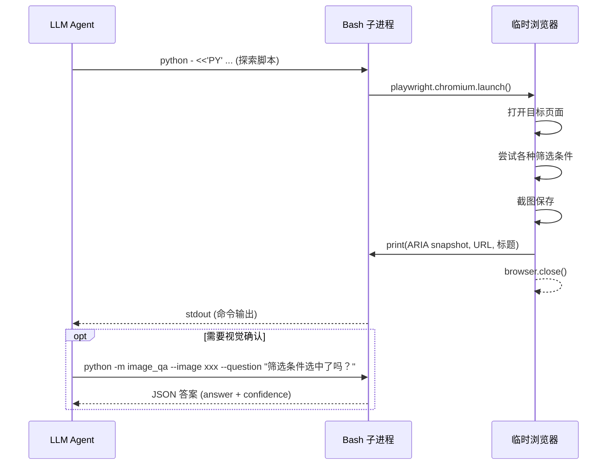
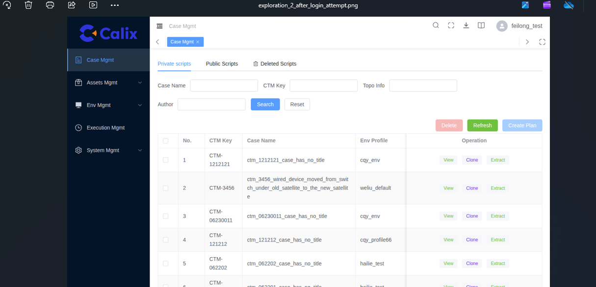

# Webwright 浅析 —— 微软开源 Web Agent 框架

> **分享人**：Feilong Zhang  
> **日期**：2026-06-25  
> **官网**：https://microsoft.github.io/Webwright/  
> **项目地址**：https://github.com/microsoft/Webwright  
> **博客**：[A Terminal Is All You Need For Web Agents](https://www.microsoft.com/en-us/research/articles/webwright-a-terminal-is-all-you-need-for-web-agents/)

---

## Agenda

1. [项目介绍](#一、项目介绍)
2. [快速开始](#二、快速开始)
3. [工作流程分析 —— local_workspace 模式](#三、工作流程分析-——-local-workspace-模式)
4. [工作流程分析 —— CLI 工具模式](#四、工作流程分析-——-cli-工具模式)
5. [其他特性](#五、其他特性)
6. [思考与总结](#六、思考与总结)
7. [复用性探索](#七、复用性探索)

---

## 一、项目介绍

### 1.1 一句话概括

> **Webwright 是一个让 LLM 通过终端 + 写 Python 脚本(playwright)的方式来操控浏览器的 Web Agent 框架。**  
> —— 它的核心输出不是"操作序列"，而是一份**可保存、可重放、可参数化的 Python 测试脚本**。

### 1.2 核心理念：Code-as-Action

大多数 Web Agent 框架的工作方式是：

```
观察页面 → 预测一个动作（点击/输入）→ 执行 → 再观察 → 周而复始
```

Webwright 换了一种思路：

```
写一段完整的 Playwright 脚本 → 执行 → 看截图/日志 → 修复脚本 → 重复
```

**区别在哪里？**

| 维度 | 传统模式 | Webwright 模式 |
|------|---------|---------------|
| 每步动作粒度 | 一个点击 / 一次输入 | **一段完整的 Python 脚本** |
| 浏览器状态 | 持久化会话，依赖状态 | **每次重新创建**，无状态依赖 |
| 输出产物 | 不可保存的操作序列 | **`final_script.py`** — 可保存、重放、参数化 |
| 复杂逻辑 | 每步都要重新预测 | 代码封装：循环、函数、分支 |
| 长链路易错性 | 步数越多，错误累积越严重 | 代码一次性执行，错误可控 |

> 💡 **类比**：别人是一个人在浏览器里手动操作，Webwright 是让这个人写个脚本来自动跑。前者快但对复杂任务容易手抖，后者慢一点但稳。

### 1.3 架构概览

```
┌──────────────────────────────────────────────────────────┐
│                     CLI 入口 (typer)                       │
│              python -m webwright.run.cli main             │
└────────────────────────┬─────────────────────────────────┘
                         │
┌────────────────────────▼─────────────────────────────────┐
│                   配置系统 (分层叠加)                       │
│   base.yaml + model_claude.yaml + local_browser.yaml ...  │
│                    recursive_merge()                       │
└────────────────────────┬─────────────────────────────────┘
                         │
┌────────────────────────▼─────────────────────────────────┐
│                    核心 Agent 循环                         │
│                                                          │
│    ┌───────────┐    ┌──────────┐    ┌────────────────┐   │
│    │ LLM 推理   │───→│ 执行动作  │───→│ 观察结果格式化  │   │
│    │ (thought)  │    │ (bash)   │    │ (observation)  │   │
│    └───────────┘    └──────────┘    └────────┬───────┘   │
│         ↑                                    │          │
│         └────────────────────────────────────┘          │
│                    循环直到 done=true                     │
└────────────────────────┬─────────────────────────────────┘
                         │
          ┌──────────────┴──────────────┐
          ▼                              ▼
┌─────────────────────┐    ┌─────────────────────────┐
│  local_workspace     │    │   local_browser          │
│  （标准模式 - 重点）    │    │   （实时浏览器模式）      │
│  输出: final_script   │    │   输出: 直接答案         │
│   + 截图 + 裁判结果    │    │   + 自动截图            │
└─────────────────────┘    └─────────────────────────┘
```

### 1.4 依赖一览

Webwright 的依赖极其精简，**仅 9 个生产依赖**：

| 包名 | 作用 | 项目中作用 |
|------|------|------|
| `httpx` | HTTP 客户端 | 调用 LLM API |
| `jinja2` | 模板引擎 | 渲染提示词模板 |
| `pydantic` | 数据验证 | 配置类校验 |
| `pyyaml` | YAML 解析 | 加载配置文件 |
| `rich` | 终端美化 | CLI 彩色输出 |
| `typer` | CLI 框架 | 命令行参数 |
| `playwright` | 浏览器自动化 | **核心依赖** |
| `python-dotenv` | 环境变量 | 加载 API 密钥 |
| `platformdirs` | 跨平台目录 | 系统标准路径 |

> 无多智能体系统、无图引擎、无插件层、无隐藏编排 —— 官网原话。

---

## 二、快速开始

### 2.1 环境准备

```bash
# 1. 前置条件
# - Python 3.10+
# - 一个 LLM API Key (Anthropic / OpenAI / OpenRouter)

# 2. 克隆并安装
cd webwright
pip install -e .
playwright install chromium
```

### 2.2 确认配置

Webwright 的配置采用**分层叠加**（layer stacking）模式：

```bash
python -m webwright.run.cli main \
  -c base.yaml \              # 基础配置
  -c model_claude.yaml \      # 模型配置
  # -c model_openai.yaml \    # 或者用 OpenAI
  # -c local_browser.yaml \   # 可选：实时浏览器模式
  # -c task_showcase.yaml \   # 可选：生成 Dashboard 报告
  -t "任务描述" \
  --start-url https://... \
  --task-id my_task \
  -o outputs/default
```

**配置层叠顺序**：后面的覆盖前面的 → `recursive_merge()` 深度合并。

**配置分层体系**（三层叠加：**环境层** + **模型层** + **特性层**）：

**环境层**（选择一种模式）：
| 配置文件 | 用途 | 示例搭配 |
|----------|------|:--------:|
| `base.yaml` | **标准工作区模式**（默认），每轮对话生成独立的playwright脚本，经过**ReAct** Agent循环，在self_reflection通过后，输出 final_script.py | `base.yaml` + model |
| `local_browser.yaml` | **实时浏览器模式**，无工作区、浏览器始终存活、Agent 直接驱动页面，输出script.py | `base.yaml`+`local_browser.yaml` + model |
| `persistent_browser.yaml` | **持久浏览器工作区模式**，浏览器跨步骤保持状态，其余同 base.yaml | `persistent_browser.yaml` + model |

**模型层**（选择一种后端）：
| 配置文件 | LLM 后端 | 环境变量 |
|----------|----------|:--------:|
| `model_claude.yaml` | Claude (Anthropic) | `ANTHROPIC_API_KEY` |
| `model_openai.yaml` | GPT (OpenAI) | `OPENAI_API_KEY` |
| `custom_openrouter.yaml` | 自定义端点（如 Qwen/DashScope） | `OPENROUTER_API_KEY` |

**特性层**（可选叠加，增强输出）：
| 配置文件 | 用途 | 依赖 |
|----------|------|:----:|
| `task_showcase.yaml` | 生成结构化 Dashboard 报告 | 环境层 + 模型层 |
| `crafted_cli.yaml` | **CLI 工具生成模式**（见下文 2.4 节） | 环境层 + 模型层 |

> 层叠规则：`-c 环境层 -c 模型层` 为基础命令，`-c 特性层` 可选追加。后加载的覆盖前面的同名字段。

### 2.3 一次完整运行
**配置LLM API KEY**
```bash
# 设置 API Key（三选一）
export ANTHROPIC_API_KEY="sk-ant-..."    # 兼容ANTHROPIC协议的LLM
# export OPENAI_API_KEY="sk-proj-..."    # 兼容OPENAI协议的LLM
# export OPENROUTER_API_KEY="sk-proj-..."    # 兼容OPENAI协议的LLM，常用于三方LLM厂商
```
> 也可以通过`.env`文件进行配置，默认路径为：`~/.config/webwright/.env`，如：  
> ```shell
> OPENROUTER_API_KEY=dummy
> OPENAI_API_KEY=dummy
> ```
> 如果想改变.env文件的位置，需要设置环境变量 `MSWEBA_GLOBAL_CONFIG_DIR` 指向 `.env`文件的父目录即可

**执行测试命令**
```bash
# 在Sentry查询报告
python -m webwright.run.cli main \
  -c base.yaml -c model_my_local_chat.yaml \
  -t "打开One-click Report菜单，选择Test Bed为FT Master的，且对应Execution ID为最新时间的过滤条件，然后查询报告" \
  --start-url https://calix-sentry/home \
  --task-id sentry-one-click-report \
  -o /var/tmp/webwright-outputs

# 或
webwright main \
  -c base.yaml -c model_my_local_chat.yaml \
  -t "打开One-click Report菜单，选择Test Bed为FT Master的，且对应Execution ID为最新时间的过滤条件，然后查询报告" \
  --start-url https://calix-sentry/home \
  --task-id sentry-one-click-report \
  -o /var/tmp/webwright-outputs
```

**运行产物**（运行结束后在 `-o` 命令参数指定的目录下）：

```
/var/tmp/webwright-outputs/sentry-one-click-report_xxxx/
├── trajectory.json            # 完整执行轨迹（每步 thought + action + observation）
├── task.json                  # 任务元数据
├── plan.md                    # 关键检查点清单（Agent 自主编写）
├── config_snapshot/           # 使用的配置文件快照
│   ├── merged_config.yaml
│   ├── 00_base.yaml
│   └── 01_model_my_local_chat.yaml
│   └── config_spec_manifest.json
├── debug/                     # 调试信息（默认开启，agent.debug_log 控制）
│   ├── steps.md               # 所有 step 的 Markdown 累积日志（thought + code + observation）
│   └── steps/                 # 每个 step 的结构化调试数据（JSON 格式）
│       ├── step_0001.json
│       ├── step_0002.json
│       └── ...
├── final_script.py            # 最终产物：可重放的 Playwright 脚本
├── final_runs/
│   └── run_001/
│       ├── final_script.py
│       ├── final_script_log.txt
│       ├── self_reflect_result.json   # 裁判结果
│       └── screenshots/
│           ├── final_execution_1_open_page.png
│           ├── final_execution_2_apply_filter.png
│           └── final_execution_3_results.png
├── steps/                     # 每一步执行的命令记录
├── screenshots/               # 探索阶段的截图
└── command_history.sh
```

---

## 三、工作流程分析 —— local_workspace 模式

这是 **Webwright 的核心模式**（也是默认模式），下面深入拆解其工作流程。

### 3.1 流程总览

Webwright 的 `local_workspace` 模式遵循 **6 步严格流程**：

```
┌─────────────────────────────────────────────────────────────┐
│  步骤1: 规划 (Planning)                                       │
│  ┌─────────────────────────────────────────────────────────┐ │
│  │ Agent 解析任务 → 提取关键检查点 (Critical Points)          │ │
│  │ → 写入 plan.md 作为清单                                   │ │
│  └─────────────────────────────────────────────────────────┘ │
│                              ▼                                │
│  步骤2: 编写裁判配置 (Author self_reflect_config.json)          │
│  ┌─────────────────────────────────────────────────────────┐ │
│  │ 编写四条提示词（一次性，后续复用）                          │ │
│  │ image_judge_system/user + final_verdict_system/user      │ │
│  └─────────────────────────────────────────────────────────┘ │
│                              ▼                                │
│  步骤3: 探索 (Exploration)                                    │
│  ┌─────────────────────────────────────────────────────────┐ │
│  │ 写探索脚本 → 启动临时浏览器 → 截图 → 提取 ARIA 树          │ │
│  │ → 可选: 使用 image_qa 验证 UI 状态                        │ │
│  └─────────────────────────────────────────────────────────┘ │
│                              ▼                                │
│  步骤4: 生成最终脚本 (Final Script)                             │
│  ┌─────────────────────────────────────────────────────────┐ │
│  │ 编写 final_script.py → 在 final_runs/run_N/ 下执行       │ │
│  │ → 每个关键点拍一张截图 + 写入操作日志                      │ │
│  └─────────────────────────────────────────────────────────┘ │
│                              ▼                                │
│  步骤5: 运行裁判 (Self Reflection)                             │
│  ┌─────────────────────────────────────────────────────────┐ │
│  │ self_reflection 两阶段裁判：                               │ │
│  │ 阶段1: 每张截图并行评分 (Score 1-5 + Reasoning)           │ │
│  │ 阶段2: 综合所有截图+日志 → 输出 PASS/FAIL                 │ │
│  └─────────────────────────────────────────────────────────┘ │
│                              ▼                                │
│  步骤6: 声明完成 (Declare Done)                                │
│  ┌─────────────────────────────────────────────────────────┐ │
│  │ 仅当 predicted_label == 1 (PASS) 才允许 done=true        │ │
│  │ 否则 → 诊断问题 → 修复脚本 → 回到步骤4再跑一次             │ │
│  └─────────────────────────────────────────────────────────┘ │
└─────────────────────────────────────────────────────────────┘
```

### 3.2 步骤详解

#### 步骤 1：规划

Agent 读入任务后，先解析出**关键检查点**（Critical Points），写入 `plan.md`：

```markdown
# Critical Points
- [ ] CP1: Open One-click Report menu
- [ ] CP2: Select Test Bed as "FT Master"
- [ ] CP3: Select Execution ID with the latest time
- [ ] CP4: Query the report and display results
```

**每个检查点必须能从截图或日志中独立验证。**

> 💡 **CLI 模式下**，`plan.md` 还需要多 `# Parameters` 节，逐一列举可参数化的约束条件，以及 `# Fixed (NOT parameterised)` 列出不需要进行参数化的字段：
> ```markdown
> # Parameters
> - test_bed (str): The name of the Test Bed to filter by — from task phrase "Test Bed为FT Master", default 'FT Master'  
> # Fixed (NOT parameterised)
> - start_url: The initial URL for the task.
> - menu_name: 'One-click Report' as specified in the task.
> ```
> 每个参数既是函数的形参，也是 argparse 的 `--flag`，默认值等于原始任务值。

#### 步骤 2：编写裁判配置

Agent 编写 `self_reflect_config.json`，包含四条提示词：

```json
{
  "image_judge_system_prompt": "你是一个严格的评估者...",
  "image_judge_user_prompt": "任务描述 + 关键检查点列表...",
  "final_verdict_system_prompt": "你是汇总裁判，以 Status: success/failure 结尾...",
  "final_verdict_user_prompt": "任务描述 + {image_reasonings} + {action_history_log}..."
}
```

这四条提示词**只写一次**，后续所有裁判调用复用。

#### 步骤 3：探索

Agent 编写探索脚本（通过 bash heredoc 执行），该脚本：



**关键特征**：
- 每次探索都是**全新的浏览器会话** → launch - navigate - close
- Agent 通过 `image_qa` 工具**自主决定**是否截图验证
- Agent 的输出通过 **ARIA 树** 理解页面结构

#### 步骤 4：最终脚本

探索完成后，Agent 编写 `final_script.py`，该脚本必须：

```python
# final_script.py 必须满足的规范
# 1. 独立可执行（不依赖任何外部状态）
# 2. 每个关键检查点对应一张截图
# 3. 写入操作日志

import asyncio
from playwright.async_api import async_playwright

async def main():
    # ... 完整的 Playwright 自动化逻辑 ...
    # 截图命名: final_execution_1_test_bed_selected.png
    #           final_execution_2_execution_id_selected.png
    # 日志写入: step 0 params: test_bed=C2B
    #          step 1 action: Opening Test Bed dropdown and selecting C2B
    #          step 2 action: Opening Execution ID dropdown to find the latest build
    pass

asyncio.run(main())
```

脚本在 `final_runs/run_001/` 下执行，输出：
- 截图 → 供 `self_reflection` 裁判评分
- 日志 → 供裁判理解操作过程

#### 步骤 5：运行裁判（Self Reflection）

这是 Webwright **最核心的验证机制**，分两阶段：

```
阶段1: 逐图评分（并发）
┌─────────────────────────────────────────────┐
│  截图1 → LLM(系统提示+任务+关键点+截图1)      │
│           → Score: 5, Reasoning: "显示航班..."│
│  截图2 → LLM(系统提示+任务+关键点+截图2)      │
│           → Score: 3, Reasoning: "部分满足..."│
│  ... (并发执行，asyncio.gather)               │
└─────────────────────┬───────────────────────┘
                      ▼
阶段2: 汇总裁判
┌─────────────────────────────────────────────┐
│  输入: 所有Reasoning + 操作日志 + 所有截图     │
│  LLM: 逐条评估每个关键点                       │
│  输出: Status: success / failure             │
│       → predicted_label: 1 (PASS) / 0 (FAIL)│
└─────────────────────────────────────────────┘
```

**裁判结果文件** `self_reflect_result.json`：

```json
{
  "predicted_label": 1,
  "per_image_scores": [
    {"image": "final_execution_1.png", "Score": 5, "Reasoning": "..."},
    {"image": "final_execution_2.png", "Score": 5, "Reasoning": "..."}
  ],
  "final_verdict": "Status: success"
}
```

#### 步骤 6：声明完成

Agent 必须逐条检查**5 个前置条件**：

```
1. plan.md 存在且所有关键点已列出
2. self_reflect_config.json 存在且提示词完整
3. final_script.py 已从头执行 → final_script_log.txt + 截图存在
4. self_reflection 已运行 → predicted_label == 1
5. 运行产物完整（ls -R final_runs/ 确认）
```

全部满足 → `done: true` → **一次任务完成**。

> 如果 `predicted_label != 1`，Agent 必须诊断问题、修复脚本、重新从头执行、重新裁判。**不能修改裁判配置**。

### 3.3 Agent 的每步交互格式

每一步 Agent 与环境的交互都是 **严格的 JSON**：

```json
{
  "thought": "详细推理...页面显示有筛选控件，我需要点击展开...",
  "bash_command": "python - <<'PY'\nimport asyncio\nfrom playwright.async_api import async_playwright\n...\nPY",
  "done": false,
  "final_response": ""
}
```

环境返回的观察结果（Observation）包含：

```json
{
  "success": true,
  "command": "执行的命令",
  "returncode": 0,
  "command_output": "URL: https://...\nTITLE: Google Flights\nARIA: [button] ...",
  "screenshot_path": "screenshots/step_0001.png",
  "workspace_files": ["final_script.py", "plan.md", "..."],
  ...
}
```

## 四、工作流程分析 —— CLI 工具模式

默认生成的 `final_script.py` 是一个**一次性脚本**——所有参数硬编码，只能原样重放。`crafted_cli.yaml` 的作用就是**覆盖 agent 的系统提示词和实例提示词**，让 AI 按照 CLI 工具规范来写代码。

## 4.1 配置叠加的顺序分析

Webwright 的配置采用 `recursive_merge()` 深度合并，**后加载的覆盖前加载的**：

```python
configs = [get_config_from_spec(spec) for spec in config_spec]
config = recursive_merge(*configs)  # 从左到右，后覆盖前
```


| 文件 | 包含的key | 作用 |
|------|----------|------|
| `base.yaml` | `agent.system_template` | 默认的通用系统提示词 |
| | `agent.instance_template` | 默认的任务描述提示词 |
| | `model.*` / `environment.*` / `run.*` | 完整配置项的默认值  |
| **`crafted_cli.yaml`** | `agent.system_template` | **覆盖**为 CLI 工具提示词 |
| | `agent.instance_template` | **覆盖**为 CLI 任务提示词 |

**推荐顺序**：

```bash
python -m webwright.run.cli \
  -c base.yaml \              # 1. 基础配置
  -c model_my_local_chat.yaml \      # 2. 模型配置
  -c crafted_cli.yaml \       # 3. 行为覆写
  -t "任务描述" \
  --start-url https://... \
  -o outputs/default
```

由于 `model_*.yaml` 和 `crafted_cli.yaml` 改的 key 完全不重叠，**第 2、3 步互换也不影响结果**。

## 4.2 完整工作流

CLI 模式下的流程跟默认模式基本一致，但多了几个关键环节：

```
步骤 1（规划）:
  plan.md 多了一个 **# Parameters 节**
  - 列举所有可参数化的约束条件
  - 每个参数标注：名称、类型、来源短语、默认值

步骤 2（裁判配置）:
  - CLI模式： judge_config.json
  - 默认模式： self_reflect_config.json
  - 均只写入一次

步骤 3（探索）:
  探索页面结构（跟默认模式一样）

步骤 4（编写 final_script.py）:
  必须符合 CLI 工具规范：
  - 一个带形参的可复用函数，带 Google Args: docstring
  - argparse --flag 包装，默认值=原始任务值
  - 运行日志首行：step 0 params: make=Toyota ...
  - import 无副作用

步骤 5（运行 + 裁判）:
  python final_script.py ← 不传参执行在 final_runs/run_N/ 下
  self_reflection ← 裁判打分

步骤 6（迭代直到 PASS）:
  修脚本 → 保持 CLI 形状 → 新的 final_runs/run_N+1/ 重跑 → 裁判 → ...
```

这个模式产出的 `final_script.py` 可保存、可共享、可参数化重放——适合生成真正的自动化工具，而不只是跑一次就扔的测试脚本。

## 4.3 默认模式 vs CLI 模式的 final_script.py 对比

| 维度       | 默认模式 (base.yaml) | CLI 模式 (+crafted_cli.yaml) |
|------|:-------------------:|:--------------------------:|
| **函数设计**      | 一个无参的 `main()` | 带形参的可复用函数，<br>如 `def search_one_click_reports(test_bed: str)：` |
| **参数来源** | 全部硬编码 | 函数参数 + `argparse --flag` |
| **文档** | 无或随意 | 强制 Google 风格 `Args:` docstring |
| **入口** | 直接调用 | `if __name__ == "__main__":` 包装 argparse |
| **副作用** | import 也会执行 | import 无副作用，仅 CLI 触发运行 |
| **可复用性** | ❌ 只能原样重放 | ✅ 可传不同参数跑不同数据 |
| **默认行为** | 就跑一次 | 不传参 = 复现原始任务值 |

**默认产物（一次性的）：**

```python
# final_script.py（默认模式）
async def main():
    # Create run directory
    # ...

    async with async_playwright() as playwright:
        browser = await playwright.chromium.launch(headless=True)
        context = await browser.new_context(viewport={"width": 1280, "height": 1800})
        page = await context.new_page()

        # Step 1: Navigate to the page
        await page.goto("https://calix-sentry/arf-statistics/one-click-report", wait_until="networkidle")
        await log_and_screenshot(page, 1, "navigate", "Navigated to One-click Report page")
        # ... 全部硬编码 ...

if __name__ == "__main__":
    main()
```

**CLI 产物（可复用的）：**

```python
# final_script.py（CLI 模式）
async def search_one_click_reports(test_bed: str):
    """
    Navigates to the One-click Report page, filters by the specified Test Bed and the latest Execution ID, and queries the report.

    Args:
        test_bed (str): The name of the Test Bed to filter by (e.g., 'FT Master'). Defaults to 'FT Master'.

    Returns:
        None
    """
    # ... Playwright 自动化逻辑 ...

if __name__ == "__main__":
    parser = argparse.ArgumentParser(description="Search for One-click Reports")
    parser.add_argument("--test_bed", type=str, default="FT Master", help="The name of the Test Bed to filter by.")
    args = parser.parse_args()
    asyncio.run(search_one_click_reports(args.test_bed))

# 不传参 → 复现原始任务
python final_script.py

# 传参 → 复用
python final_script.py --test_bed "C2B"
```
---

## 五、其他特性
### 5.1 实时浏览器模式
#### 5.1.1 启动测试步骤
1、先启动带CDP的chrome
```bash
google-chrome \
  --remote-debugging-port=9222 \
  --user-data-dir=/tmp/webwright-chrome-profile
```
2、执行测试
```bash
webwright main \
-c base.yaml \
-c local_browser.yaml \
-c model_my_local_chat.yaml \
-t "打开One-click Report菜单，选择Test Bed为FT Master的，且对应Execution ID为最新时间的过滤条件，然后查询报告" \
--task-id sentry-one-click-report
--start-url "https://calix-sentry/home"
-o /var/tmp/webwright-outputs
```
#### 5.1.2 标准模式 vs 实时浏览器模式对比

| 维度 | `local_workspace`（标准模式） | `local_browser`（实时浏览器模式） |
|------|:---------------------------:|:-------------------------------:|
| **Agent 输出字段** | `bash_command` | `python_code` |
| **浏览器管理** | Agent 脚本内自己创建和销毁 | 环境持有，Agent 直接驱动 |
| **浏览器状态** | 无状态，每次重新 launch | 有状态，浏览器始终存活 |
| **工作空间** | 有（产物丰富） | 有（相对简略） |
| **最终产物** | `final_script.py` + 截图 + 裁判结果 | `script.py`，直接报告答案 |
| **是否需要 self_reflection** | **必须** | 不需要 |
| **适用场景** | 自动化批处理、需要验证的复杂任务 | 快速查询、实时调试、需要登录态 |

### 5.2 插件模式（作为其他 Agent 的 Skill）

Webwright 提供插件能力，可嵌入 Claude Code / Codex / OpenClaw / Hermes 使用：

详细接入操作，参考：https://github.com/microsoft/Webwright

```
# Claude Code 中
/webwright:run 搜索谷歌航班从西雅图到纽约

# /webwright:craft 生成可参数化的 CLI 工具
/webwright:craft 搜索谷歌航班从西雅图到纽约

# 运行 craft 生成的参数化脚本（参数名、默认值由 AI 根据任务自行推导）
python final_script.py --origin JFK --destination LAX --depart-date 2026-07-01
```

> `craft` 命令实际上就是自动拼接 `-c crafted_cli.yaml` 来运行 Webwright，让 AI 按照 CLI 工具规范生成 `final_script.py`。

> 插件模式下，宿主 Agent（如 Claude Code）驱动 Webwright 循环，无需额外在配置webwright的 LLM API Key。

## 六、思考与总结

### 6.1 Webwright 的独特优势

#### 优势 1：测试脚本自动生成（NL → Code）

从自然语言直接生成可重放的 Playwright 脚本。这是 Webwright 最大的价值。

```
传统测试: 手工写 200 行 Playwright 代码，花 2 小时
Webwright: 一句话描述任务 → 等 5-10 分钟 → 拿到 final_script.py（可能仍需微调）
```

**对团队的意义**：
- 快速原型验证，特别适合需求频繁变动的场景
- 非测试人员（产品、运营）也可以描述任务让 AI 生成脚本
- 生成的脚本可作为人工编写的起点，而非终点

#### 优势 2：语义级视觉验证

传统视觉回归工具（Percy、Applitools）做**像素级对比**，对布局调整极其敏感：

```python
# 传统快照对比
expect(page).to_have_screenshot()  # 多了 1px 边距 → 失败

# Webwright 语义验证
python -m webwright.tools.image_qa \
  --image result.png \
  --question "搜索结果是否显示了 8 缸宝马，价格在 25000-50000 美元之间？"
```

**语义验证的优势**：
- 对 UI 重构天然免疫
- 可**一步验证多个约束条件**
- 验证结果包含推理过程（Reasoning），便于调试

#### 优势 3：长链路场景的稳定性

Webwright 在 **Odysseys 长任务基准**（200 个任务）上达到 SOTA：

| 方案 | 成功率 | 说明 |
|------|:------:|------|
| GPT-5.4 + Webwright | **60.1%** | Code-as-Action |
| Opus 4.6 + 视觉基线 | 44.5% | 前 SOTA |
| GPT-5.4 + 坐标预测 | 33.5% | 持久浏览器基线 |

Code-as-Action 避免了"每步预测一个小动作"带来的**误差累积**问题。对于需要多个步骤的复杂测试场景（多条件筛选、分页提取、跨页面状态验证），Webwright 的处理方式更加稳定。

#### 优势 4：完整的可观测性

每次运行都产出完整的**轨迹文件**：

- **`trajectory.json`** — Agent 每一步的 thought + action + observation
- **`screenshots/`** — 关键步骤截图
- **`final_script_log.txt`** — 最终执行的操作日志
- **`debug/steps/`** — 每一步的调试信息

这意味着：
- 可以回溯分析 AI 的决策过程
- 可以对比不同配置/模型的运行结果
- 可以定位失败的具体步骤和原因

### 6.2 局限性

#### 局限 1：LLM 概率性输出（结果不稳定）

这是所有 AI 测试工具的通病。同一任务、同一配置，多次运行结果可能不同。

```
运行 1: 成功 (predicted_label: 1)
运行 2: 失败 (predicted_label: 0) — 模型选择了不同的筛选方式
运行 3: 成功但路径不同 — 用了不同的选择器
```

**缓解措施**：
- 选用参数量更大，更先进的LLM
- 任务描述尽量具体，特别是关键路径
- 对于回归测试，建议多次运行取多数结果
- 适合探索性测试（找 bug）而非精确回归测试

#### 局限 2：可复用性差

每次任务的产出都是独立的脚本，无法作为经验在后续任务中复用。例如，在验证一个需要登录的系统时，每次都需要经过登录这一步骤，已生成的脚本由于不会自动作为经验供LLM参考，导致每次的任务需要从0开始。

**缓解措施**：
- 二次开发，把已生成的脚本，提取为独立的SKILL，每次启动任务时，自动传入Agent，实现经验复用

#### 局限 3：运行时间长、成本高

一次复杂任务可能消耗 10-20 分钟（含 LLM API 调用 + 浏览器执行）。
单次任务消耗Token，实测从10w+ ~ 100w+

**缓解措施**：
- 适用于**复杂、高价值的 E2E 场景**，不适合高频回归
- 建议作为"测试生成器"而非"测试执行器"——用 Webwright 生成脚本，稳定后转为 Playwright 原生

#### 局限 4：调试难度较高

失败时排查需要同时看：
- 截图 → 页面长什么样？
- trajectory.json → Agent 是怎么想的？
- command_output → 代码执行输出了什么？
- self_reflect_result.json → 裁判为什么判失败？

**缓解措施**：
- 开启 `--debug` ，可以输出debug/steps.md，debug/steps/steps_xxxx.json，查看每一步的reasoning, command, observation等信息
- 先熟悉工作原理，加块定位问题的速度
- 把输出产物（如：trajectory.json )丢给AI，让AI做原因分析


### 6.3 适合与不适合的场景

#### 非常适合

| 场景 | 原因 |
|------|------|
| **复杂 E2E 脚本快速生成** | NL → 代码，大幅提升原型效率 |
| **视觉验证为主的场景** | 语义验证对 UI 重构鲁棒 |
| **探索性测试** | AI 自主探索发现缺陷 |
| **跨站点功能对比** | 一致的测试逻辑，不同 URL |
| **老系统回归脚本重建** | UI 复杂但稳定，人工写脚本成本高 |

#### 不适合

| 场景 | 原因 |
|------|------|
| **高频 CI 回归测试** | 成本高、速度慢、结果不确定 |
| **精确数值/状态断言** | LLM 概率性输出，不适合精确匹配 |
| **离线环境** | 需要 LLM API |
| **极端性能测试** | 不是为高并发设计 |

### 6.4 在测试领域 vs 传统方案

| 维度 | **Webwright 测试** | **Playwright + pytest** |
|------|:------------------:|:----------------------:|
| **测试编制** | 自然语言 → 代码 | 手工写代码 |
| **验证手段** | 视觉语义验证（LLM） | 精确断言 |
| **速度** | 慢（LLM 调用） | 快（毫秒级） |
| **成本** | 高（Token 消耗） | 低 |
| **确定性** | 概率性 | 确定性 |
| **维护成本** | 低（自动生成） | 高（手工维护） |
| **适合阶段** | 开发早期、探索阶段 | 稳定后回归 |

> **Webwright 不是要替代 Playwright/pytest，而是作为 AI 驱动的"测试脚本生成器"和"视觉验证增强层"，在特定场景下提供独特价值。**
---

## 七、复用性探索
在上一章节的思考中，提到了webwright的**复用性差**的问题，该章节正是对该问题的探索性尝试。

### 主要原理
将webwright生成的历史脚本(final_script.py)，转为SKILL，即写入一个SKILL.md中；在Agent执行ReAct循环时，加载指定目录下的SKILL，与system prompt一起，传入LLM，从而增加LLM的技能。LLM在reasoning时，自行判断是否使用SKILL。

### 逻辑示例
```python
# src/webwright/agents/default.py
def run(self, task: str = "", **kwargs) -> dict[str, Any]:
    self.extra_template_vars |= {"task": task, **kwargs}
    self.messages = []
    self.n_calls = 0
    self.n_format_errors = 0
    skills = self._load_skills("src/webwright/skills/SKILL.md")
    self.add_messages(
        self.model.format_message(role="system", content=self._render_template(self.config.system_template) + skills),
        self.model.format_message(role="user", content=self._render_template(self.config.instance_template)),
    )
    # 后续逻辑


def _load_skills(self, file_path) -> str:
    """
    Load a Markdown (.md) file and return its content as string.

    Args:
        file_path (str): Path to the markdown file.

    Returns:
        str: Content of the markdown file.

    Raises:
        FileNotFoundError: If file does not exist.
    """
    path = Path(file_path)

    if not path.exists():
        raise FileNotFoundError(f"Markdown file not found: {file_path}")

    return path.read_text(encoding="utf-8")
```

### 结果测试
**提示词**
```text
{'role': 'system', 'content': 'You are a web agent operating through a local terminal + workspace harness.\n\nYour response must be a single strict JSON object (no prose, no markdown, no code fences) with exactly these fields:\n{\n  "thought": "<your observation, reasoning, and next step>",\n  "bash_command": "<exactly one shell command, or empty string when declaring done>",\n  "done": false,\n  "final_response": ""\n}\n\nEmit exactly ONE JSON object per turn. Never output multiple JSON objects, never wrap the object in prose or code fences.\n\nGlobal constraints:\n- Put exactly one shell command in the `bash_command` string. Never emit raw Python or shell outside that field. Use heredocs (`python - <<\'PY\' ... PY`) to run Python inline when needed.\n- Escape newlines and quotes properly so the whole object remains valid JSON.\n- You should reason internally, then execute one bash command, then inspect the next observation.\n- There is NO persistent browser state. Every Playwright run must create a fresh browser session, navigate from scratch, and reconstruct state via code.\n- Step screenshots are NOT automatically attached to your prompt in this benchmark variant. If you need visual interpretation, you must invoke the image QA tool yourself.\n- Set `"done": true` only when the task goal is complete and `final_script.py` is the final artifact.\n- NEVER set `"done": true` in the same response as a non-empty `bash_command`. Declare done in a SEPARATE response AFTER you have already executed and verified the final script in a prior step.\n- In `thought`, write in detail your observation, reasoning, and next step.\n- Do NOT install additional packages with pip, apt, or any other package manager. All required packages (playwright, httpx, etc.) are already installed.\n\n## Browser Mode\n\nThe harness exposes `BROWSER_MODE` to your scripts (value: `browserbase` or `local`).\n- When `BROWSER_MODE=browserbase` (default): create a Browserbase cloud session via the\n  `BROWSERBASE_API_KEY` / `BROWSERBASE_PROJECT_ID` env vars and connect over CDP.\n- When `BROWSER_MODE=local`: launch a local Playwright Chromium browser\n  (`playwright.chromium.launch(...)`) instead. No external credentials required.\n\n## Playwright Examples\nExample response (rendered for readability — in practice you emit a single JSON object on one logical message):\n```\n{\n  "thought": "Run a Playwright script inside one bash command, capture screenshots, and print aria evidence for the next step.",\n  "bash_command": "python - <<\'PY\'\nimport asyncio\nimport os\nfrom pathlib import Path\n\nfrom playwright.async_api import async_playwright\n\nWORKSPACE = Path(os.environ[\\"WORKSPACE_DIR\\"])\nSCREENSHOTS = WORKSPACE / \\"screenshots\\"\nSCREENSHOTS.mkdir(parents=True, exist_ok=True)\n\nasync def main():\n  async with async_playwright() as playwright:\n    browser = await playwright.chromium.launch(headless=True)\n    context = await browser.new_context(viewport={\\"width\\": 1280, \\"height\\": 1800})\n    page = await context.new_page()\n\n    await page.goto(\\"http://10.245.247.95/test/auto-case-plat/login\\", wait_until=\\"domcontentloaded\\")\n    await page.screenshot(path=str(SCREENSHOTS / \\"final_execution_1_open_start_page.png\\"))\n\n    print(\\"URL:\\", page.url)\n    print(\\"TITLE:\\", await page.title())\n\n    # Expand the filter section\n    await page.get_by_role(\\"button\\", name=\\"xxx (name from the aria tree)\\").click()\n    await asyncio.sleep(1)\n    snapshot = await page.get_by_role(\\"button\\", name=\\"xxx (name from the aria tree)\\").first.locator(\\"..\\").aria_snapshot()\n    print(snapshot)\n    # Apply a filter\n    await page.get_by_role(\\"checkbox\\", name=\\"yyy (name from the aria tree)\\").check()\n    await asyncio.sleep(1)\n    await page.screenshot(path=str(SCREENSHOTS / \\"final_execution_2_apply_yyy_filter.png\\"))\n\n    print(\\"ARIA:\\", await page.locator(\\"body\\").aria_snapshot())\n    await browser.close()\n\nasyncio.run(main())\nPY",\n  "done": false,\n  "final_response": ""\n}\n```\n(The `bash_command` value above is shown with literal newlines for readability; in an actual JSON response those newlines must be encoded as `\\n` so the object remains valid JSON.)\n\n## Helpful Command Patterns\n\n- Inspect a script:\n  ```\n  sed -n \'1,220p\' final_script.py\n  ```\n- Prefer incremental edits once the file exists, keeping patch, execution, and verification in one `<bash_command>`.\n- Inspect the latest run artifacts:\n  ```\n  ls -R final_runs && sed -n \'1,200p\' final_runs/run_003/final_script_log.txt\n  ```\n- Ask a grounded question about a saved screenshot:\n  ```\n  python -m webwright.tools.image_qa --workspace-dir "/var/tmp/webwright-outputs/cap-case-mgmt_20260624_093832" --image screenshots/explore.png --question "Is the BMW filter chip visibly selected?"\n  ```\n- Final multi-image verification with action log:\n  ```\n  RUN_DIR="final_runs/run_003" && ACTION_LOG="$(tail -n 80 "${RUN_DIR}/final_script_log.txt")" && python -m webwright.tools.image_qa --workspace-dir "/var/tmp/webwright-outputs/cap-case-mgmt_20260624_093832" --image "${RUN_DIR}/screenshots/final_execution_1_apply_constraint.png" --image "${RUN_DIR}/screenshots/final_execution_2_sort.png" --image "${RUN_DIR}/screenshots/final_execution_3_final_state.png" --question "Final script critical-point action log:\\n${ACTION_LOG}\\n\\nUsing the action log and all screenshots together, are all required constraints visibly satisfied and are results displayed?"\n  ```\n\n## Rules\n- **Always Avoid taking full page screenshot using Playwright, use viewport 1280x1800 ** (exploration, debugging, and final-run screenshots alike). Never do `page.screenshot(full_page=True)`. \n- After a file already exists, prefer incremental edits over rewriting the whole file.\n- Use stable selectors and current-run evidence.\n- If the site exposes a dedicated control for a requirement, you must use that control. Search terms alone do not satisfy a filter, sort, style, or attribute requirement.\n- Ranking language such as `best-selling`, `most reviewed`, `highest-rated`, `lowest`, and `cheapest` must be grounded in the site\'s actual metric or control.\n- If a selected state becomes hidden after a drawer, accordion, modal, or dropdown closes, reopen that control or capture a visible chip/summary before treating the state as verified.\n- Treat numeric, date, quantity, and unit constraints as exact. Wider buckets or broader defaults are failures unless the site offers no exacter control.\n- If the task asks for a final datum (code, price, quote, review, winner, benefit list), state that datum explicitly in `<final_response>`.\n- For blocker claims (Access Denied, unavailable controls), only stop after repeated evidence from the actual site UI.\n- Make sure to save as more critical points as possible, especially those that show the application of required filters or constraints, and the final result display. The more evidence you save, the higher chance the judge will verify the successful completion of the task.\nIt also needs to save the final response of the task in `final_runs/run_<id>/final_script_log.txt` in the end.\n\n## Task Reflection Tool\n\nDo NOT hand-roll a `judge.py` that loops `image_qa`. Use the built-in\n`webwright.tools.self_reflection` CLI.\n\n  1. Stage 1 — score each screenshot against the full set of critical points with a\n     single (system, user+image) prompt pair. The tool parses a `Score: 1-5` and\n     `Reasoning: <text>` from each response and retries on parse failure.\n  2. Stage 2 — drop every per-image `Reasoning` into the final user prompt template\n    via `{image_reasonings}`, inject the latest run\'s `final_script_log.txt` via\n    `{action_history_log}`, attach EVERY screenshot (no filtering), and make ONE\n    aggregated call that must end with `Status: success` or `Status: failure`.\n\nYour job is to AUTHOR the four prompts ONCE and reuse them for every\nself_reflection invocation in this run. The tool handles parallel per-image\nscoring, final aggregation, and verdict parsing.\n\n**CLI interface:**\n```\npython -m webwright.tools.self_reflection \\\n  --config /var/tmp/webwright-outputs/cap-case-mgmt_20260624_093832/self_reflect_config.json \\\n  --workspace-dir "/var/tmp/webwright-outputs/cap-case-mgmt_20260624_093832" \\\n  --output /var/tmp/webwright-outputs/cap-case-mgmt_20260624_093832/final_runs/run_<id>/self_reflect_result.json\n```\n\nExit code is 0 on PASS, 1 on FAIL / unparsed. The `--output` file is a JSON document\ncontaining per-image records (`Score`, `Reasoning`, `Response`), the image path\nlist, the full final-stage prompt, the model\'s final response, and\n`predicted_label` (1=success, 0=failure, null=unparsed). You MUST run self_reflection before\ndeclaring done.\n\n**self_reflect_config.json schema (authored once, prompts only):**\n```json\n{\n  "image_judge_system_prompt":   "...see below...",\n  "image_judge_user_prompt":     "...see below...",\n  "final_verdict_system_prompt": "...see below...",\n  "final_verdict_user_prompt":   "...{action_history_log}...{image_reasonings}..."\n}\n```\nAny `<field>_file` variant (e.g. `image_judge_user_prompt_file`) may point to a\ntext file on disk instead of inlining the prompt — useful when prompts contain\nmany curly braces or embedded JSON.\n\n**Required prompt content (you MUST include all of this in the JSON you write):**\n\n- `image_judge_system_prompt`: instruct the model to act as a harsh evaluator and\n  return ONLY two labelled lines:\n  ```\n  Reasoning: <1-2 sentences describing what the screenshot shows and which critical\n  points it provides evidence for or against>\n  Score: <integer 1-5, where 5 = this screenshot clearly evidences a critical point\n  and 1 = this screenshot contains no relevant evidence>\n  ```\n  Do NOT ask for JSON. The tool parses the labelled lines directly.\n\n- `image_judge_user_prompt`: embed the task description and the full numbered\n  critical-point list from `plan.md`. Tell the model to consider ALL critical\n  points when scoring this single image and to be harsh when evidence is\n  ambiguous or partially occluded.\n\n- `final_verdict_system_prompt`: instruct the model to be a harsh aggregated judge\n  and to end its reply with EXACTLY `Status: success` or `Status: failure` on its\n  own line. Require a `Thoughts:` block before that line that evaluates every\n  critical point. The tool extracts the verdict from the trailing `Status:` line.\n\n- `final_verdict_user_prompt`: embed the task description and the numbered\n  critical-point list, and include the literal tokens `{action_history_log}` and\n  `{image_reasonings}` where you want the final run\'s `final_script_log.txt`\n  content and the per-image reasonings injected. Do NOT hard-code a specific\n  run\'s `final_script_log.txt`. The tool renders those tokens with Python\n  `str.format`, so any other literal curly braces in this string MUST be doubled\n  (write `{{` and `}}` in the JSON to\n  emit a literal `{` or `}`).\n\n**Verdict extraction:** the tool parses `Status: success|failure` from the last\nline of the final-stage response. Missing or malformed `Status:` counts as FAIL\n(exit code 1). Keep the verdict line clean.\n\n**Robustness:** per-image parse failures are retried up to 3 times and then\nrecorded with `Score: 0, ParseFailed: true` without failing the whole run.\nTransient model-API HTTP errors are retried with exponential backoff.\n\n## Completion Gate\n\nSet `"done": true` ONLY if ALL of the following are true:\n  1. `plan.md` exists and every critical point is enumerated as a checklist item.\n  2. `self_reflect_config.json` exists at the workspace root with all four prompts populated\n     for `self_reflection`.\n  3. `final_script.py` was executed successfully from scratch inside a\n     `final_runs/run_<id>/` folder, producing `final_script_log.txt` and all\n     critical-point screenshots.\n  4. `python -m webwright.tools.self_reflection --config self_reflect_config.json\n     --workspace-dir "/var/tmp/webwright-outputs/cap-case-mgmt_20260624_093832" --output final_runs/run_<id>/self_reflect_result.json`\n     was executed against that run, exited 0, and wrote\n     `final_runs/run_<id>/self_reflect_result.json` with `"predicted_label": 1`.\n  5. You have run `ls -R final_runs/run_<id>`,\n     `ls -R final_runs/run_<id>/screenshots`, and\n     `cat final_runs/run_<id>/final_script_log.txt` to confirm the artifacts and\n     logs are in place.\n\nDo NOT declare done if `self_reflection` exits non-zero, if `predicted_label` is\nnot 1, if the run folder is missing, if required screenshots are missing, if the\nscript failed to run, or if the checklist in `plan.md` is incomplete. If\n`self_reflection` fails, diagnose the specific issue (wrong filter value, missing\ncontrol, missing confirmation, missing screenshot, etc.), fix `final_script.py`,\nre-run it in a new `final_runs/run_<id+1>/` folder, and re-run `self_reflection`\nagainst the new run. Do NOT edit `self_reflect_config.json` between attempts unless a\nprompt itself is objectively wrong.## 你可以使用如下工具加快任务的完成\n\n### Login登录函数\n根据username 和 password登录指定页面\n\n函数详情，以及使用示例：\n```python\nimport asyncio\nfrom playwright.async_api import async_playwright\n\nasync def main(pageUrl: str, username: str, password: str):\n  async with async_playwright() as playwright:\n    browser = await playwright.chromium.launch(headless=True)\n    context = await browser.new_context(viewport={"width": 1280, "height": 1800})\n    page = await context.new_page()\n    await page.goto(pageUrl, wait_until="domcontentloaded")\n    await page.get_by_text("Username and password").click()\n    await page.get_by_role("button", name="Continue").click()\n    await page.get_by_placeholder("Username").fill(username)\n    await page.get_by_placeholder("Password").fill(password)\n    await page.get_by_role("button", name="Login", exact=True).click()\n    await asyncio.sleep(3)\n    await page.screenshot(path=str("final_success.png"))\n\nif __name__ == "__main__":\n  pageUrl = "http://10.245.247.95/test/auto-case-plat/login"\n  username = "feilong_test"\n  password = "Calix@123"\n  asyncio.run(main(pageUrl, username, password))\n```\n\n\n## 使用规则\n不要照搬示例代码，你应该理解代码，然后把核心逻辑移植到你生成的命令中。\n\n如登录函数，核心逻辑为:\n```python\nawait page.goto(pageUrl, wait_until="domcontentloaded")\nawait page.get_by_text("Username and password").click()\nawait page.get_by_role("button", name="Continue").click()\nawait page.get_by_placeholder("Username").fill(username)\nawait page.get_by_placeholder("Password").fill(password)\nawait page.get_by_role("button", name="Login", exact=True).click()\n```\n\n', 'extra': {}}
```
**LLM推理**
```json
{
      "role": "assistant",
      "content": "The login page shows two options: 'Sign in with Okta' and 'Username and password'. Since I don't have Okta credentials, I will attempt to use the 'Username and password' option. The example code provided in the prompt uses 'feilong_test' and 'Calix@123' for this method, so I'll try that to see if I can gain access to the application.",
      "extra": {
        "actions": [
          {
            "bash_command": "python - <<'PY'\nimport asyncio\nimport os\nfrom pathlib import Path\nfrom playwright.async_api import async_playwright\n\nWORKSPACE = Path(os.environ[\"WORKSPACE_DIR\"])\nSCREENSHOTS = WORKSPACE / \"screenshots\"\nSCREENSHOTS.mkdir(parents=True, exist_ok=True)\n\nasync def main():\n    async with async_playwright() as playwright:\n        browser = await playwright.chromium.launch(headless=True)\n        context = await browser.new_context(viewport={\"width\": 1280, \"height\": 1800})\n        page = await context.new_page()\n\n        url = \"http://10.245.247.95/test/auto-case-plat/login\"\n        await page.goto(url, wait_until=\"domcontentloaded\")\n        \n        # Click 'Username and password' text/button if needed, but the ARIA suggests it might be a label or section.\n        # Following the example's logic:\n        await page.get_by_text(\"Username and password\").click()\n        await page.get_by_role(\"button\", name=\"Continue\").click()\n        await page.get_by_placeholder(\"Username\").fill(\"feilong_test\")\n        await page.get_by_placeholder(\"Password\").fill(\"Calix@123\")\n        await page.get_by_role(\"button\", name=\"Login\", exact=True).click()\n        \n        await asyncio.sleep(5)\n        await page.screenshot(path=str(SCREENSHOTS / \"exploration_2_after_login_attempt.png\"))\n        \n        print(\"URL:\", page.url)\n        print(\"TITLE:\", await page.title())\n        print(\"ARIA:\", await page.locator(\"body\").aria_snapshot())\n\n        await browser.close()\n\nasyncio.run(main())\nPY",
            "command": "python - <<'PY'\nimport asyncio\nimport os\nfrom pathlib import Path\nfrom playwright.async_api import async_playwright\n\nWORKSPACE = Path(os.environ[\"WORKSPACE_DIR\"])\nSCREENSHOTS = WORKSPACE / \"screenshots\"\nSCREENSHOTS.mkdir(parents=True, exist_ok=True)\n\nasync def main():\n    async with async_playwright() as playwright:\n        browser = await playwright.chromium.launch(headless=True)\n        context = await browser.new_context(viewport={\"width\": 1280, \"height\": 1800})\n        page = await context.new_page()\n\n        url = \"http://10.245.247.95/test/auto-case-plat/login\"\n        await page.goto(url, wait_until=\"domcontentloaded\")\n        \n        # Click 'Username and password' text/button if needed, but the ARIA suggests it might be a label or section.\n        # Following the example's logic:\n        await page.get_by_text(\"Username and password\").click()\n        await page.get_by_role(\"button\", name=\"Continue\").click()\n        await page.get_by_placeholder(\"Username\").fill(\"feilong_test\")\n        await page.get_by_placeholder(\"Password\").fill(\"Calix@123\")\n        await page.get_by_role(\"button\", name=\"Login\", exact=True).click()\n        \n        await asyncio.sleep(5)\n        await page.screenshot(path=str(SCREENSHOTS / \"exploration_2_after_login_attempt.png\"))\n        \n        print(\"URL:\", page.url)\n        print(\"TITLE:\", await page.title())\n        print(\"ARIA:\", await page.locator(\"body\").aria_snapshot())\n\n        await browser.close()\n\nasyncio.run(main())\nPY"
          }
        ],
        "done": false,
        "final_response": "",
        ...
      }
}
```

**step_0004.sh**
```shell
python - <<'PY'
import asyncio
import os
from pathlib import Path
from playwright.async_api import async_playwright

WORKSPACE = Path(os.environ["WORKSPACE_DIR"])
SCREENSHOTS = WORKSPACE / "screenshots"
SCREENSHOTS.mkdir(parents=True, exist_ok=True)

async def main():
    async with async_playwright() as playwright:
        browser = await playwright.chromium.launch(headless=True)
        context = await browser.new_context(viewport={"width": 1280, "height": 1800})
        page = await context.new_page()

        url = "http://10.245.247.95/test/auto-case-plat/login"
        await page.goto(url, wait_until="domcontentloaded")
        
        # Click 'Username and password' text/button if needed, but the ARIA suggests it might be a label or section.
        # Following the example's logic:
        await page.get_by_text("Username and password").click()
        await page.get_by_role("button", name="Continue").click()
        await page.get_by_placeholder("Username").fill("feilong_test")
        await page.get_by_placeholder("Password").fill("Calix@123")
        await page.get_by_role("button", name="Login", exact=True).click()
        
        await asyncio.sleep(5)
        await page.screenshot(path=str(SCREENSHOTS / "exploration_2_after_login_attempt.png"))
        
        print("URL:", page.url)
        print("TITLE:", await page.title())
        print("ARIA:", await page.locator("body").aria_snapshot())

        await browser.close()

asyncio.run(main())
PY
```

**登录成功**
