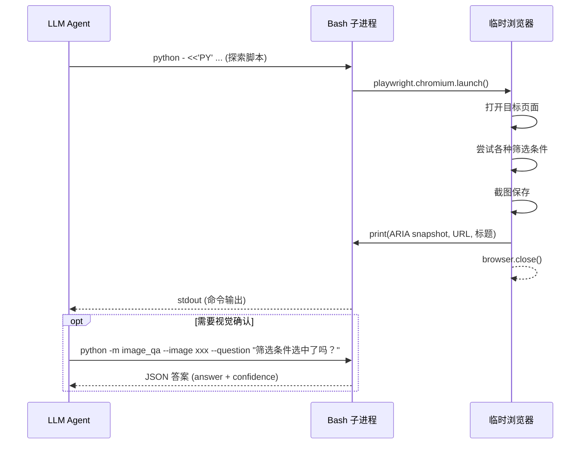

# Webwright 浅析 —— 团队内部分享

> **分享人**：________________  
> **日期**：2026-06-21  
> **版本**：v0.1.0（微软研究院开源，~1.5k LoC）  
> **项目地址**：https://github.com/microsoft/Webwright  
> **博客**：[A Terminal Is All You Need For Web Agents](https://www.microsoft.com/en-us/research/articles/webwright-a-terminal-is-all-you-need-for-web-agents/)

---

## 目录

1. [项目介绍](#一项目介绍)
2. [快速开始](#二快速开始)
3. [工作流程分析 —— local_workspace 模式](#三工作流程分析--local_workspace-模式)
4. [CLI 工具模式 —— crafted_cli.yaml](#四cli-工具模式--crafted_cliyaml)
5. [在 AI 自动化测试领域的优缺点思考](#五在-ai-自动化测试领域的优缺点思考)
6. [与其他方案对比](#六与其他方案对比)
7. [总结与建议](#七总结与建议)

---

## 一、项目介绍

### 1.1 一句话概括

> **Webwright 是一个让 LLM 通过终端 + 写 Python 脚本的方式来操控浏览器的 Web Agent 框架。**  
> —— 它的核心输出不是"操作序列"，而是一份**可保存、可重放、可参数化的 Python 测试脚本**。

### 1.2 核心理念：Code-as-Action

大多数 Web Agent 框架的工作方式是：

```
观察页面 → 预测一个动作（点击/输入）→ 执行 → 再观察 → 周而复始
```

Webwright 换了一种思路：

```
写一段完整的 Playwright 脚本 → 执行 → 看截图/日志 → 修复脚本 → 重复
```

**区别在哪里？**

| 维度 | 传统模式 | Webwright 模式 |
|------|---------|---------------|
| 每步动作粒度 | 一个点击 / 一次输入 | **一段完整的 Python 脚本** |
| 浏览器状态 | 持久化会话，依赖状态 | **每次重新创建**，无状态依赖 |
| 输出产物 | 不可保存的操作序列 | **`final_script.py`** — 可保存、重放、参数化 |
| 复杂逻辑 | 每步都要重新预测 | 代码封装：循环、函数、分支 |
| 长链路易错性 | 步数越多，错误累积越严重 | 代码一次性执行，错误可控 |

> 💡 **类比**：别人是一个人在浏览器里手动操作，Webwright 是让这个人写个脚本来自动跑。前者快但对复杂任务容易手抖，后者慢一点但稳。

### 1.3 架构概览

```
┌──────────────────────────────────────────────────────────┐
│                     CLI 入口 (typer)                       │
│              python -m webwright.run.cli                   │
└────────────────────────┬─────────────────────────────────┘
                         │
┌────────────────────────▼─────────────────────────────────┐
│                   配置系统 (分层叠加)                       │
│   base.yaml + model_claude.yaml + local_browser.yaml ...  │
│                    recursive_merge()                       │
└────────────────────────┬─────────────────────────────────┘
                         │
┌────────────────────────▼─────────────────────────────────┐
│                    核心 Agent 循环                         │
│                                                          │
│    ┌───────────┐    ┌──────────┐    ┌────────────────┐   │
│    │ LLM 推理   │───→│ 执行动作  │───→│ 观察结果格式化  │   │
│    │ (thought)  │    │ (bash)   │    │ (observation)  │   │
│    └───────────┘    └──────────┘    └────────┬───────┘   │
│         ↑                                    │          │
│         └────────────────────────────────────┘          │
│                    循环直到 done=true                     │
└────────────────────────┬─────────────────────────────────┘
                         │
          ┌──────────────┴──────────────┐
          ▼                              ▼
┌─────────────────────┐    ┌─────────────────────────┐
│  local_workspace     │    │   local_browser          │
│  （标准模式 - 重点）    │    │   （实时浏览器模式）      │
│  输出: final_script   │    │   输出: 直接答案         │
│   + 截图 + 裁判结果    │    │   + 自动截图            │
└─────────────────────┘    └─────────────────────────┘
```

### 1.4 依赖一览

Webwright 的依赖极其精简，**仅 9 个生产依赖**：

| 包名 | 作用 | 评注 |
|------|------|------|
| `httpx` | HTTP 客户端 | 调用 LLM API |
| `jinja2` | 模板引擎 | 渲染提示词模板 |
| `pydantic` | 数据验证 | 配置类校验 |
| `pyyaml` | YAML 解析 | 加载配置文件 |
| `rich` | 终端美化 | CLI 彩色输出 |
| `typer` | CLI 框架 | 命令行参数 |
| `playwright` | 浏览器自动化 | **核心依赖** |
| `python-dotenv` | 环境变量 | 加载 API 密钥 |
| `platformdirs` | 跨平台目录 | 系统标准路径 |

> 无多智能体系统、无图引擎、无插件层、无隐藏编排 —— 官网原话。

---

## 二、快速开始

### 2.1 环境准备

```bash
# 前置条件
# - Python 3.10+
# - 一个 LLM API Key (Anthropic / OpenAI / OpenRouter)

# 1. 克隆并安装
cd webwright
pip install -e .
playwright install chromium

# 2. 设置 API Key（二选一）
export ANTHROPIC_API_KEY="sk-ant-..."    # 使用 Claude
# export OPENAI_API_KEY="sk-proj-..."    # 使用 GPT
```

### 2.2 配置文件系统

Webwright 的配置采用**分层叠加**（layer stacking）模式：

```bash
python -m webwright.run.cli \
  -c base.yaml \              # 基础配置（必须，模型无关）
  -c model_claude.yaml \      # 模型配置（必须，二选一）
  # -c model_openai.yaml \    # 或者用 OpenAI
  # -c local_browser.yaml \   # 可选：实时浏览器模式
  # -c task_showcase.yaml \   # 可选：生成 Dashboard 报告
  -t "任务描述" \
  --start-url https://... \
  --task-id my_task \
  -o outputs/default
```

**配置层叠顺序**：后面的覆盖前面的 → `recursive_merge()` 深度合并。

**配置文件清单**：

| 配置文件 | 用途 | 是否可单独运行 |
|----------|------|:------------:|
| `base.yaml` | **核心基础配置**，模型无关 | ❌ 须叠加模型配置 |
| `model_claude.yaml` | Claude (Anthropic) 模型层 | ❌ 须叠加 |
| `model_openai.yaml` | GPT (OpenAI) 模型层 | ❌ 须叠加 |
| `local_browser.yaml` | **实时浏览器模式** | ❌ 须叠加 |
| `task_showcase.yaml` | 生成结构化 Dashboard 报告 | ❌ 须叠加 |
| `custom_openrouter.yaml` | 自定义 OpenRouter（如 Qwen） | ❌ 须叠加 |
| `crafted_cli.yaml` | **CLI 工具模式**（下面 2.6 节详解） | ❌ 须叠加 + base.yaml |

### 2.3 一次完整运行

```bash
# 最简单的运行：搜索航班
python -m webwright.run.cli \
  -c base.yaml -c model_openai.yaml \
  -t "Search for flights from SEA to JFK on 2026-08-15 to 2026-08-20" \
  --start-url https://www.google.com/flights \
  --task-id demo_openai \
  -o outputs/default
```

**运行产物**（运行结束后在 `outputs/` 目录下）：

```
outputs/demo_openai_20260621_143000/
├── trajectory.json            # 完整执行轨迹（每步 thought + action + observation）
├── task.json                  # 任务元数据
├── plan.md                    # 关键检查点清单（✏️ Agent 自主编写）
├── config_snapshot/           # 使用的配置文件快照
│   ├── merged_config.yaml
│   ├── 00_base.yaml
│   └── 01_model_openai.yaml
├── final_script.py            # 🎯 最终产物：可重放的 Playwright 脚本
├── final_runs/
│   └── run_001/
│       ├── final_script.py
│       ├── final_script_log.txt
│       ├── self_reflect_result.json   # 📊 裁判结果
│       └── screenshots/
│           ├── final_execution_1_open_page.png
│           ├── final_execution_2_apply_filter.png
│           └── final_execution_3_results.png
├── steps/                     # 每一步执行的命令记录
├── screenshots/               # 探索阶段的截图
└── command_history.sh
```

### 2.4 调试模式

```bash
# --debug 模式：打开浏览器窗口 + DevTools + 250ms 慢动作
python -m webwright.run.cli \
  -c base.yaml -c model_claude.yaml \
  -t "搜索 bilibili 上 Python 教程" \
  --debug
```

`--debug` 会自动设置：
- `headless: false`（显示浏览器窗口）
- `devtools: true`（打开开发者工具）
- `keep_open_on_exit: true`（运行结束后不关闭浏览器）
- `slow_mo_ms: 250`（每个操作延迟 250ms，方便观察）

### 2.5 插件模式（作为其他 Agent 的 Skill）

Webwright 提供插件能力，可嵌入 Claude Code / Codex / OpenClaw / Hermes 使用：

```
# Claude Code 中
/webwright:run 搜索谷歌航班从西雅图到纽约

# /webwright:craft 生成可参数化的 CLI 工具
/webwright:craft 搜索谷歌航班从西雅图到纽约

# 运行 craft 生成的参数化脚本（参数名、默认值由 AI 根据任务自行推导）
python final_script.py --origin JFK --destination LAX --depart-date 2026-07-01
```

> `craft` 命令实际上就是自动拼接 `-c crafted_cli.yaml` 来运行 Webwright，让 AI 按照 CLI 工具规范生成 `final_script.py`。

> 插件模式下，宿主 Agent（如 Claude Code）驱动 Webwright 循环，无需额外 LLM API Key。

### 2.6 CLI 工具模式（crafted_cli.yaml）

默认生成的 `final_script.py` 是一个**一次性脚本**——所有参数硬编码，只能原样重放。`crafted_cli.yaml` 的作用就是**覆盖 agent 的系统提示词和实例提示词**，让 AI 按照 CLI 工具规范来写代码。

#### 2.6.1 配置叠加原理

Webwright 的配置采用 `recursive_merge()` 深度合并，**后加载的覆盖前加载的**：

```python
configs = [get_config_from_spec(spec) for spec in config_spec]
config = recursive_merge(*configs)  # 从左到右，后覆盖前
```

三个文件的 key 路径完全不重叠，所以可以用任意顺序叠加：

| 文件 | 改的 key | 作用 |
|------|----------|------|
| `base.yaml` | `agent.system_template` | 默认的通用系统提示词 |
| | `agent.instance_template` | 默认的任务描述提示词 |
| | `model.*` / `environment.*` / `run.*` | 空壳 + 默认值 |
| `model_openai.yaml` | `model.model_class` / `.model_name` / `.openai_endpoint` | 模型参数 |
| `model_claude.yaml` | `model.model_class` / `.model_name` | 模型参数 |
| **`crafted_cli.yaml`** | `agent.system_template` | **覆盖**为 CLI 工具提示词 |
| | `agent.instance_template` | **覆盖**为 CLI 任务提示词 |

**推荐顺序**（语义清晰，不改也行）：

```bash
python -m webwright.run.cli \
  -c base.yaml \              # 1. 基础配置
  -c model_openai.yaml \      # 2. 模型配置
  -c crafted_cli.yaml \       # 3. 行为覆写
  -t "任务描述" \
  --start-url https://... \
  -o outputs/default
```

由于 `model_*.yaml` 和 `crafted_cli.yaml` 改的 key 完全不重叠，**第 2、3 步互换也不影响结果**。

#### 2.6.2 默认模式 vs CLI 模式的 final_script.py 对比

| 维度 | 默认模式 (base.yaml) | CLI 模式 (+crafted_cli.yaml) |
|------|:-------------------:|:--------------------------:|
| **函数设计** | 一个无参的 `main_impl()` | 带形参的可复用函数，如 `def search_cars(make, model, ...)` |
| **参数来源** | 全部硬编码 | 函数参数 + `argparse --flag` |
| **文档** | 无或随意 | 强制 Google 风格 `Args:` docstring |
| **入口** | 直接调用 | `if __name__ == "__main__":` 包装 argparse |
| **副作用** | import 也会执行 | import 无副作用，仅 CLI 触发运行 |
| **可复用性** | ❌ 只能原样重放 | ✅ 可传不同参数跑不同数据 |
| **默认行为** | 就跑一次 | 不传参 = 复现原始任务值 |

**默认产物（一次性的）：**

```python
# final_script.py（默认模式）
def main_impl():
    url = "https://www.xiaohongshu.com/explore"
    keywords = ["阿根廷", "世界杯"]
    # ... 全部硬编码 ...

if __name__ == "__main__":
    main_impl()
```

**CLI 产物（可复用的）：**

```python
# final_script.py（CLI 模式）
def search_cars(make="Toyota", model="Corolla", min_year=2018, max_year=2023, color="red"):
    \"\"\"
    Search for cars on CarMax with specified filters.

    Args:
        make (str): Vehicle manufacturer — from task "Toyota"
        model (str): Vehicle model — from task "Corolla"
        ...
    \"\"\"
    # ... Playwright 自动化逻辑 ...

if __name__ == "__main__":
    import argparse
    parser = argparse.ArgumentParser()
    parser.add_argument("--make", default="Toyota")
    parser.add_argument("--model", default="Corolla")
    ...
    args = parser.parse_args()
    search_cars(**vars(args))

# 不传参 → 复现原始任务
python final_script.py

# 传参 → 复用
python final_script.py --make Honda --model Civic --min-year 2020
```

#### 2.6.3 完整工作流

CLI 模式下的流程跟默认模式基本一致，但多了几个关键环节：

```
步骤 1（规划）:
  plan.md 多了一个 # Parameters 节
  - 列举所有可参数化的约束条件
  - 每个参数标注：名称、类型、来源短语、默认值
  
步骤 2（裁判配置）:
  ✏️ judge_config.json（跟默认模式一样，一次写入）
  
步骤 3（探索）:
  🔍 探索页面结构（跟默认模式一样）
  
步骤 4（编写 final_script.py）:
  必须符合 CLI 工具规范：
  - 一个带形参的可复用函数，带 Google Args: docstring
  - argparse --flag 包装，默认值=原始任务值
  - 运行日志首行：step 0 params: make=Toyota ...
  - import 无副作用
  
步骤 5（运行 + 裁判）:
  python final_script.py ← 不传参执行在 final_runs/run_N/ 下
  self_reflection ← 裁判打分
  
步骤 6（迭代直到 PASS）:
  修脚本 → 保持 CLI 形状 → 新的 final_runs/run_N+1/ 重跑 → 裁判 → ...
```

这个模式产出的 `final_script.py` 可保存、可共享、可参数化重放——适合生成真正的自动化工具，而不只是跑一次就扔的测试脚本。

---

## 三、工作流程分析 —— local_workspace 模式

这是 **Webwright 的核心模式**（也是默认模式），下面深入拆解其工作流程。

### 3.1 流程总览

Webwright 的 `local_workspace` 模式遵循 **6 步严格流程**：

```
┌─────────────────────────────────────────────────────────────┐
│  步骤1: 规划 (Planning)                                       │
│  ┌─────────────────────────────────────────────────────────┐ │
│  │ Agent 解析任务 → 提取关键检查点 (Critical Points)          │ │
│  │ → 写入 plan.md 作为清单                                   │ │
│  └─────────────────────────────────────────────────────────┘ │
│                              ▼                                │
│  步骤2: 编写裁判配置 (Author self_reflect_config.json)          │
│  ┌─────────────────────────────────────────────────────────┐ │
│  │ 编写四条提示词（一次性，后续复用）                          │ │
│  │ image_judge_system/user + final_verdict_system/user      │ │
│  └─────────────────────────────────────────────────────────┘ │
│                              ▼                                │
│  步骤3: 探索 (Exploration)                                    │
│  ┌─────────────────────────────────────────────────────────┐ │
│  │ 写探索脚本 → 启动临时浏览器 → 截图 → 提取 ARIA 树          │ │
│  │ → 可选: 使用 image_qa 验证 UI 状态                        │ │
│  └─────────────────────────────────────────────────────────┘ │
│                              ▼                                │
│  步骤4: 生成最终脚本 (Final Script)                             │
│  ┌─────────────────────────────────────────────────────────┐ │
│  │ 编写 final_script.py → 在 final_runs/run_N/ 下执行       │ │
│  │ → 每个关键点拍一张截图 + 写入操作日志                      │ │
│  └─────────────────────────────────────────────────────────┘ │
│                              ▼                                │
│  步骤5: 运行裁判 (Self Reflection)                             │
│  ┌─────────────────────────────────────────────────────────┐ │
│  │ self_reflection 两阶段裁判：                               │ │
│  │ 阶段1: 每张截图并行评分 (Score 1-5 + Reasoning)           │ │
│  │ 阶段2: 综合所有截图+日志 → 输出 PASS/FAIL                 │ │
│  └─────────────────────────────────────────────────────────┘ │
│                              ▼                                │
│  步骤6: 声明完成 (Declare Done)                                │
│  ┌─────────────────────────────────────────────────────────┐ │
│  │ 仅当 predicted_label == 1 (PASS) 才允许 done=true        │ │
│  │ 否则 → 诊断问题 → 修复脚本 → 回到步骤4再跑一次             │ │
│  └─────────────────────────────────────────────────────────┘ │
└─────────────────────────────────────────────────────────────┘
```

### 3.2 步骤详解

#### 步骤 1：规划

Agent 读入任务后，先解析出**关键检查点**（Critical Points），写入 `plan.md`：

```markdown
# Critical Points
- [ ] CP1: 打开谷歌航班页面
- [ ] CP2: 选择出发地 SEA
- [ ] CP3: 选择目的地 JFK
- [ ] CP4: 选择出发日期 2026-08-15
- [ ] CP5: 选择返程日期 2026-08-20
- [ ] CP6: 筛选直飞航班
- [ ] CP7: 显示搜索结果
```

**每个检查点必须能从截图或日志中独立验证。**

> 💡 **CLI 模式下**，`plan.md` 还需要多一个 `# Parameters` 节，逐一列举可参数化的约束条件：
> ```markdown
> # Parameters
> - make (str): 车辆品牌 — 来自 "red Toyota" — 默认 Toyota
> - model (str): 车辆型号 — 来自 "Corolla" — 默认 Corolla
> - min_year (int): 最小年份 — 来自 "2018" — 默认 2018
> ```
> 每个参数既是函数的形参，也是 argparse 的 `--flag`，默认值等于原始任务值。

#### 步骤 2：编写裁判配置

Agent 编写 `self_reflect_config.json`，包含四条提示词：

```json
{
  "image_judge_system_prompt": "你是一个严格的评估者...",
  "image_judge_user_prompt": "任务描述 + 关键检查点列表...",
  "final_verdict_system_prompt": "你是汇总裁判，以 Status: success/failure 结尾...",
  "final_verdict_user_prompt": "任务描述 + {image_reasonings} + {action_history_log}..."
}
```

这四条提示词**只写一次**，后续所有裁判调用复用。

#### 步骤 3：探索

Agent 编写探索脚本（通过 bash heredoc 执行），该脚本：



**关键特征**：
- 每次探索都是**全新的浏览器会话** → launch - navigate - close
- Agent 通过 `image_qa` 工具**自主决定**是否截图验证
- Agent 的输出通过 **ARIA 树** 理解页面结构

#### 步骤 4：最终脚本

探索完成后，Agent 编写 `final_script.py`，该脚本必须：

```python
# final_script.py 必须满足的规范
# 1. 独立可执行（不依赖任何外部状态）
# 2. 每个关键检查点对应一张截图
# 3. 写入操作日志

import asyncio
from playwright.async_api import async_playwright

async def main():
    # ... 完整的 Playwright 自动化逻辑 ...
    # 截图命名: final_execution_1_open_page.png
    #           final_execution_2_apply_filter.png
    # 日志写入: step 1 action: 打开航班搜索页面
    #           step 2 action: 设置出发地和目的地
    pass

asyncio.run(main())
```

脚本在 `final_runs/run_001/` 下执行，输出：
- 截图 → 供 `self_reflection` 裁判评分
- 日志 → 供裁判理解操作过程

#### 步骤 5：运行裁判（Self Reflection）

这是 Webwright **最核心的验证机制**，分两阶段：

```
阶段1: 逐图评分（并发）
┌─────────────────────────────────────────────┐
│  截图1 → LLM(系统提示+任务+关键点+截图1)      │
│           → Score: 5, Reasoning: "显示航班..."│
│  截图2 → LLM(系统提示+任务+关键点+截图2)      │
│           → Score: 3, Reasoning: "部分满足..."│
│  ... (并发执行，asyncio.gather)               │
└─────────────────────┬───────────────────────┘
                      ▼
阶段2: 汇总裁判
┌─────────────────────────────────────────────┐
│  输入: 所有Reasoning + 操作日志 + 所有截图     │
│  LLM: 逐条评估每个关键点                       │
│  输出: Status: success / failure             │
│       → predicted_label: 1 (PASS) / 0 (FAIL)│
└─────────────────────────────────────────────┘
```

**裁判结果文件** `self_reflect_result.json`：

```json
{
  "predicted_label": 1,
  "per_image_scores": [
    {"image": "final_execution_1.png", "Score": 5, "Reasoning": "..."},
    {"image": "final_execution_2.png", "Score": 5, "Reasoning": "..."}
  ],
  "final_verdict": "Status: success"
}
```

#### 步骤 6：声明完成

Agent 必须逐条检查**5 个前置条件**：

```
□ 1. plan.md 存在且所有关键点已列出
□ 2. self_reflect_config.json 存在且提示词完整
□ 3. final_script.py 已从头执行 → final_script_log.txt + 截图存在
□ 4. self_reflection 已运行 → predicted_label == 1
□ 5. 运行产物完整（ls -R final_runs/ 确认）
```

全部满足 → `done: true` → **一次任务完成**。

> ⚠️ 如果 `predicted_label != 1`，Agent 必须诊断问题、修复脚本、重新从头执行、重新裁判。**不能修改裁判配置**。

### 3.3 Agent 的每步交互格式

每一步 Agent 与环境的交互都是 **严格的 JSON**：

```json
{
  "thought": "详细推理...页面显示有筛选控件，我需要点击展开...",
  "bash_command": "python - <<'PY'\nimport asyncio\nfrom playwright.async_api import async_playwright\n...\nPY",
  "done": false,
  "final_response": ""
}
```

环境返回的观察结果（Observation）包含：

```json
{
  "success": true,
  "command": "执行的命令",
  "returncode": 0,
  "command_output": "URL: https://...\nTITLE: Google Flights\nARIA: [button] ...",
  "screenshot_path": "screenshots/step_0001.png",
  "workspace_files": ["final_script.py", "plan.md", "..."]
}
```

### 3.4 标准模式 vs 实时浏览器模式对比

| 维度 | `local_workspace`（标准模式） | `local_browser`（实时浏览器模式） |
|------|:---------------------------:|:-------------------------------:|
| **Agent 输出字段** | `bash_command` | `python_code` |
| **浏览器管理** | Agent 脚本内自己创建和销毁 | 环境持有，Agent 直接驱动 |
| **浏览器状态** | ❌ 无状态，每次重新 launch | ✅ 有状态，浏览器始终存活 |
| **工作空间** | ✅ 有（产物丰富） | ❌ 无（不写文件） |
| **最终产物** | `final_script.py` + 截图 + 裁判结果 | 无需产物，直接报告答案 |
| **是否需要 self_reflection** | ✅ **必须** | ❌ 不需要 |
| **适用场景** | 自动化批处理、需要验证的复杂任务 | 快速查询、实时调试、需要登录态 |

---

## 五、在 AI 自动化测试领域的优缺点思考

### 5.1 Webwright 的独特优势

#### ✅ 优势 1：测试脚本自动生成（NL → Code）

从自然语言直接生成可重放的 Playwright 脚本。这是 Webwright 最大的价值。

```
传统测试: 手工写 200 行 Playwright 代码，花 2 小时
Webwright: 一句话描述任务 → 等 5-10 分钟 → 拿到 final_script.py（可能仍需微调）
```

**对团队的意义**：
- 快速原型验证，特别适合需求频繁变动的场景
- 非测试人员（产品、运营）也可以描述任务让 AI 生成脚本
- 生成的脚本可作为人工编写的起点，而非终点

#### ✅ 优势 2：语义级视觉验证

传统视觉回归工具（Percy、Applitools）做**像素级对比**，对布局调整极其敏感：

```python
# 传统快照对比
expect(page).to_have_screenshot()  # 多了 1px 边距 → 失败

# Webwright 语义验证
python -m webwright.tools.image_qa \
  --image result.png \
  --question "搜索结果是否显示了 8 缸宝马，价格在 25000-50000 美元之间？"
```

**语义验证的优势**：
- 对 UI 重构天然免疫
- 可**一步验证多个约束条件**
- 验证结果包含推理过程（Reasoning），便于调试

#### ✅ 优势 3：长链路场景的稳定性

Webwright 在 **Odysseys 长任务基准**（200 个任务）上达到 SOTA：

| 方案 | 成功率 | 说明 |
|------|:------:|------|
| GPT-5.4 + Webwright | **60.1%** | Code-as-Action |
| Opus 4.6 + 视觉基线 | 44.5% | 前 SOTA |
| GPT-5.4 + 坐标预测 | 33.5% | 持久浏览器基线 |

Code-as-Action 避免了"每步预测一个小动作"带来的**误差累积**问题。对于需要多个步骤的复杂测试场景（多条件筛选、分页提取、跨页面状态验证），Webwright 的处理方式更加稳定。

#### ✅ 优势 4：完整的可观测性

每次运行都产出完整的**轨迹文件**：

- **`trajectory.json`** — Agent 每一步的 thought + action + observation
- **`screenshots/`** — 关键步骤截图
- **`final_script_log.txt`** — 最终执行的操作日志
- **`debug/steps/`** — 每一步的调试信息

这意味着：
- 可以回溯分析 AI 的决策过程
- 可以对比不同配置/模型的运行结果
- 可以定位失败的具体步骤和原因

#### ✅ 优势 5：Token 成本可控

基于 README 的实测数据（搜索二手宝马任务）：

| 指标 | Webwright 本地模式 | Codex Skill 模式 |
| --- | ---: | ---: |
| 输入 Token | 420,433 | 3,271,143 |
| 输出 Token | 3,593 | 20,040 |
| 总 Token | **424,026** | **3,291,183** |

Webwright 独立运行时 Token 消耗仅为 Codex Skill 模式的 **~1/8**。

### 5.2 局限性

#### ❌ 局限 1：LLM 概率性输出

这是所有 AI 测试工具的通病。同一任务、同一配置，多次运行结果可能不同。

```
运行 1: 成功 (predicted_label: 1)
运行 2: 失败 (predicted_label: 0) — 模型选择了不同的筛选方式
运行 3: 成功但路径不同 — 用了不同的选择器
```

**缓解措施**：
- 关键路径需要补充精确断言
- 对于回归测试，建议多次运行取多数结果
- 适合探索性测试（找 bug）而非精确回归测试

#### ❌ 局限 2：无原生测试框架集成

Webwright 是一个独立的 CLI 工具，没有 pytest/unittest 的 API 接口。集成到现有测试框架需要包装 CLI 调用：

```python
import subprocess

def test_flight_search():
    result = subprocess.run([
        "python", "-m", "webwright.run.cli",
        "-c", "base.yaml", "-c", "model_claude.yaml",
        "-t", "搜索西雅图到纽约的航班",
        "--start-url", "https://www.google.com/flights",
        "-o", "outputs/test_run"
    ], capture_output=True, text=True, timeout=600)
    assert "predicted_label" in result.stdout
```

**缓解措施**：可以编写轻量封装层，将 Webwright 运行包装为 pytest fixture。

#### ❌ 局限 3：运行时间长、成本高

一次复杂任务可能消耗 3-10 分钟（含 LLM API 调用 + 浏览器执行）。

**缓解措施**：
- 适用于**复杂、高价值的 E2E 场景**，不适合高频回归
- 建议作为"测试生成器"而非"测试执行器"——用 Webwright 生成脚本，稳定后转为 Playwright 原生

#### ❌ 局限 4：调试难度较高

失败时排查需要同时看：
- 截图 → 页面长什么样？
- trajectory.json → Agent 是怎么想的？
- command_output → 代码执行输出了什么？
- self_reflect_result.json → 裁判为什么判失败？

**缓解措施**：
- 使用 `--debug` 模式可以看到浏览器实时运行
- `debug/steps/*.json` 记录了每步的完整信息
- 熟悉后可以快速定位问题（通常在"选择器不对"或"控件找不到"）

#### ❌ 局限 5：需要 LLM API Key

运行时需要连接 Anthropic/OpenAI API，意味着：
- 无法在完全离线的环境运行
- 需要企业 API Key 和网络访问
- 受 API 限速和可用性影响

#### ❌ 局限 6：单任务驱动，无测试套件概念

Webwright 一次运行解决一个任务。没有"测试套件"、"测试集"、"批量运行"等概念。

**缓解措施**：
- 可自行编写脚本循环运行多个任务
- `task_showcase` 模式提供了 Dashboard 用于集中展示

### 5.3 适合与不适合的场景

#### ✅ 非常适合

| 场景 | 原因 |
|------|------|
| **复杂 E2E 脚本快速生成** | NL → 代码，大幅提升原型效率 |
| **视觉验证为主的场景** | 语义验证对 UI 重构鲁棒 |
| **探索性测试** | AI 自主探索发现缺陷 |
| **跨站点功能对比** | 一致的测试逻辑，不同 URL |
| **老系统回归脚本重建** | UI 复杂但稳定，人工写脚本成本高 |

#### ⚠️ 不适合

| 场景 | 原因 |
|------|------|
| **高频 CI 回归测试** | 成本高、速度慢、结果不确定 |
| **精确数值/状态断言** | LLM 概率性输出，不适合精确匹配 |
| **离线环境** | 需要 LLM API |
| **极端性能测试** | 不是为高并发设计 |

---

## 六、与其他方案对比

### 6.1 同类 Web Agent 框架对比

| 维度 | **Webwright** | **Browser-Use** | **Stagehand** | **Playwright 原生** |
|------|:-----------:|:---------------:|:------------:|:-----------------:|
| **范式** | Code-as-Action | 每步预测动作 | NL + 代码混合 | 纯代码 |
| **脚本可保存** | ✅ 是 | ❌ 否 | ⚠️ 部分 | ✅ 是 |
| **长链路稳定性** | ✅ 高（代码封装） | ⚠️ 一般（误差累积） | ⚠️ 一般 | ✅ 最高 |
| **验证能力** | ✅ 内建视觉裁判 | ❌ 无 | ❌ 无 | 需自行编写 |
| **部署门槛** | ✅ 低（pip） | ⚠️ 中 | ⚠️ 中 | ✅ 低 |
| **代码量** | ~1.5k LoC | ~50k LoC | ~100k LoC | N/A |
| **依赖** | 9 个包 | 大量 | 大量 | 极少 |

### 6.2 在测试领域 vs 传统方案

| 维度 | **Webwright 测试** | **Playwright + pytest** |
|------|:------------------:|:----------------------:|
| **测试编制** | 自然语言 → 代码 | 手工写代码 |
| **验证手段** | 视觉语义验证（LLM） | 精确断言 |
| **速度** | 慢（LLM 调用） | 快（毫秒级） |
| **成本** | 高（Token 消耗） | 低 |
| **确定性** | 概率性 | 确定性 |
| **维护成本** | 低（自动生成） | 高（手工维护） |
| **适合阶段** | 开发早期、探索阶段 | 稳定后回归 |

### 6.3 建议的组合策略

```
┌─────────────────────────────────────────────────────────────┐
│                   测试生命周期                                │
│                                                              │
│  需求变更 → 探索性测试                                        │
│       │                                                      │
│       ├── Webwright 自动生成 E2E 脚本 ← AI 快速原型           │
│       │       ↓                                              │
│  脚本审查 → 人工审查/修改 final_script.py                     │
│       │       ↓                                              │
│  稳定脚本 → 基于 final_script.py 编写 pytest 精确断言          │
│       │       ↓                                              │
│  回归测试 → Playwright + pytest CI 执行 ← 确定性回归           │
│       │       ↓                                              │
│  页面变更 → Webwright 重新生成 → 对比差异                     │
│       │       ↓                                              │
│  补充断言 → 更新 pytest 用例                                  │
└─────────────────────────────────────────────────────────────┘
```

---

## 七、总结与建议

### 7.1 一句话总结

> **Webwright 不是要替代 Playwright/pytest，而是作为 AI 驱动的"测试脚本生成器"和"视觉验证增强层"，在特定场景下提供独特价值。**

### 7.2 Webwright 的定位

```
┌──────────────────────────────────────────────────┐
│                  测试金字塔                          │
│                                                    │
│                    /＼                               │
│                   /  ＼     E2E 测试                  │
│                  /    ＼   (Webwright 生成脚本)       │
│                 /      ＼                            │
│                /────────\ 集成测试                    │
│               /          \  (Playwright + pytest)    │
│              /            \                          │
│             /──────────────\ 单元测试                 │
│            /                \ (pytest)               │
│           /                  \                       │
│                                                    │
│  Webwright 位置：E2E 层的"AI 加速器"                  │
│  不是取代，而是补充                                    │
└──────────────────────────────────────────────────┘
```

### 7.3 推荐团队落地路径

| 阶段 | 行动 | 预期产出 |
|------|------|---------|
| **第 1 周** | 团队 1-2 人试点运行现有任务 | 评估效果和成本 |
| **第 2 周** | 选定 3-5 个适合的 E2E 场景 | 一批 AI 生成的测试脚本 |
| **第 3 周** | 评估 AI 生成脚本的质量和可用性 | 确定哪些场景值得用 |
| **第 4 周** | 建立 Webwright + pytest 组合流程 | 稳定的混合测试流程 |

### 7.4 推荐评分

| 维度 | 评分 | 说明 |
|------|:----:|------|
| 测试脚本生成能力 | ⭐⭐⭐⭐⭐ | NL → 可重放脚本，效率极高 |
| 视觉验证能力 | ⭐⭐⭐⭐ | 语义级，对 UI 重构鲁棒 |
| 长链路处理 | ⭐⭐⭐⭐⭐ | SOTA 基准成绩 |
| 与现有框架集成 | ⭐⭐⭐ | 需要 CLI 包装 |
| 结果确定性 | ⭐⭐⭐ | LLM 概率性输出 |
| 运行成本 | ⭐⭐⭐ | Token 消耗较高 |
| 上手难度 | ⭐⭐⭐⭐⭐ | 配置简单，命令直观 |

---

## 附录

### A. 关键链接

| 资源 | 链接 |
|------|------|
| GitHub 仓库 | https://github.com/microsoft/Webwright |
| 项目页面 | https://microsoft.github.io/Webwright/ |
| 技术博客 | https://www.microsoft.com/en-us/research/articles/webwright-a-terminal-is-all-you-need-for-web-agents/ |

### B. 本地环境验证

```bash
# 验证 Webwright 环境是否就绪
cd /home/feilong/repositories/Webwright

# 1. 确认 Python 版本
python --version  # 需 >= 3.10

# 2. 确认 Playwright 已安装
playwright --version

# 3. 检查 API Key
echo ${ANTHROPIC_API_KEY:+ANTHROPIC_API_KEY 已设置}
echo ${OPENAI_API_KEY:+OPENAI_API_KEY 已设置}

# 4. 检查 CLI 是否可用
python -m webwright.run.cli --help

# 5. 运行 doctor 诊断
python -m webwright.run.cli doctor
```

### C. 现有分析文档索引

| 文档 | 内容 |
|------|------|
| `base_prompts_zh.md` | base.yaml 提示词模板中文翻译 |
| `config_analysis.md` | 配置文件系统分析 |
| `image_qa_and_self_reflection.md` | 图像质检与自反思工具分析 |
| `workspace_vs_browser_mode.md` | 两种环境模式对比 |
| `pyproject_analysis.md` | pyproject.toml 配置分析 |
| `python_packaging_explained.md` | Python 打包机制解析 |
| `shell_quickref.md` | Shell 常用命令速查 |
| `ai_automation_testing_analysis.md` | AI 自动化测试可用性分析 |
